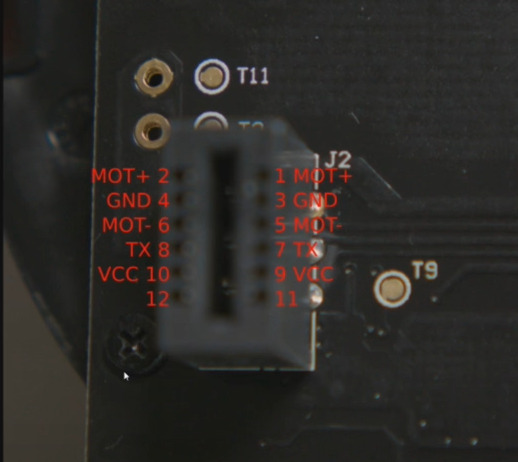
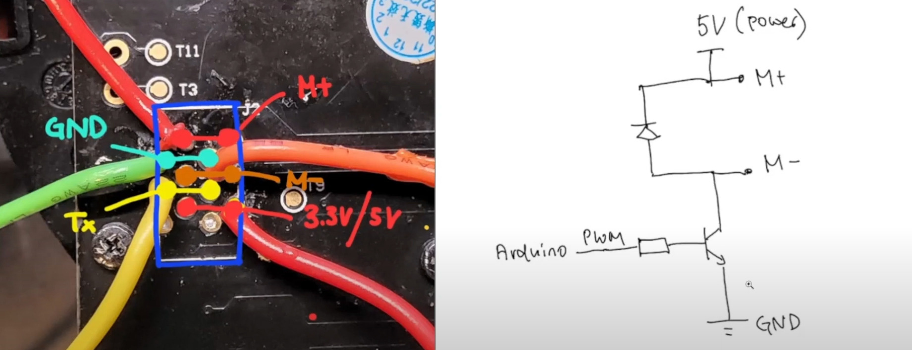

STYTJ02YM lidar

https://www.youtube.com/watch?v=S_xONJO4-Q0&t=2s

How to use a $20 laser distance sensor (from vacuum robots)
https://www.youtube.com/watch?v=mbxZAlJjE8A

https://www.youtube.com/shorts/WMxK5FvlEKs
https://www.youtube.com/watch?v=b5hEG3b_Kec

https://github.com/engineerm-jp/vacuum_robot_lidar