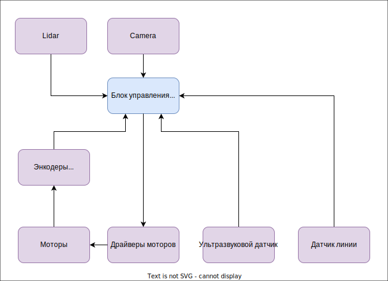
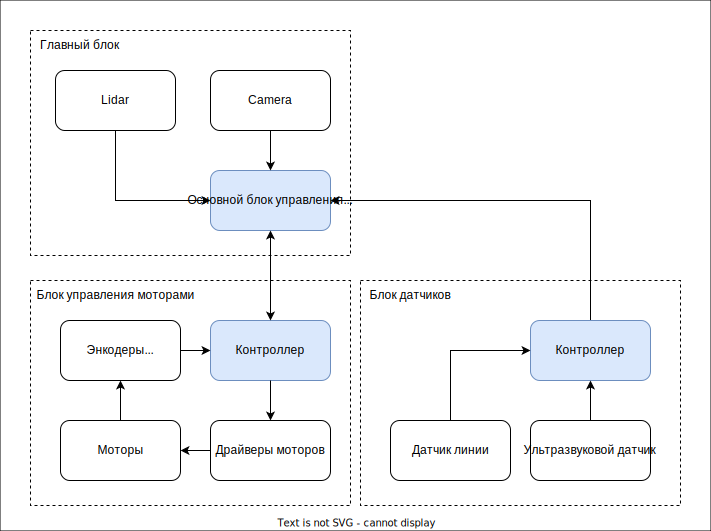
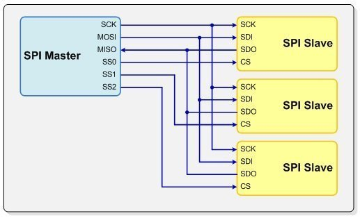
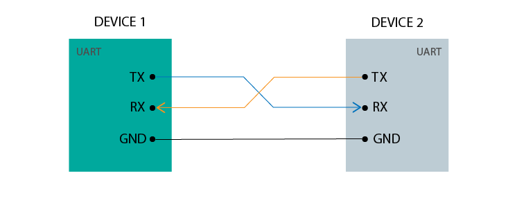
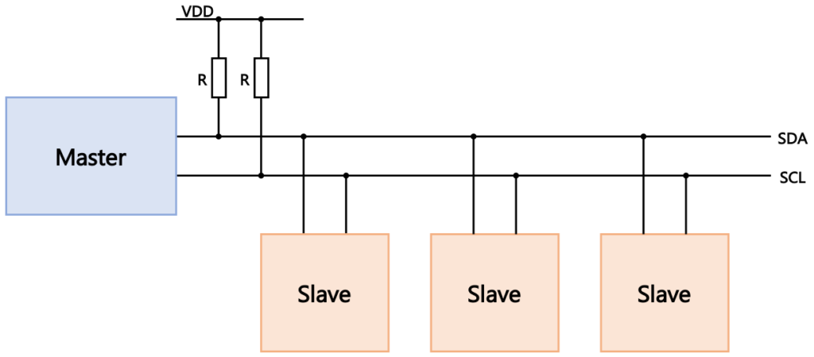
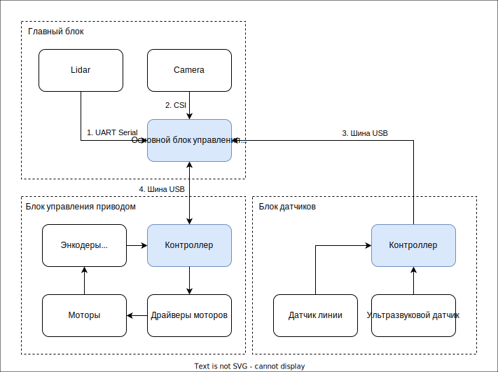

<!-- TOC -->
* [Компонентая архитектура](#компонентая-архитектура)
  * [Требования](#требования)
  * [Компоненты](#компоненты)
    * [Централизованная схема](#централизованная-схема)
    * [Распределенная схема](#распределенная-схема)
  * [Интерфейсы](#интерфейсы)
<!-- TOC -->

# Компонентая архитектура

## Требования

Глобально у нас есть три задачи:

* Сбор информации с различных датчиков
* Анализ состояния системы
* Управление двигателями для изменения положения в пространстве. 

Центральный компонент это блок управления на базе одноплатного компьютера. Будем ориентироваться на RPI5 и Orange PI 5 plus.

На входе у нас могут быть следующие источники информации:

* Камера
* Лидар
* Датчик линии
* Датчик расстояния
* Энкодеры моторов

На выходе мы управляем моторами:

* Драйвер моторов

## Компоненты

### Централизованная схема

При подключении всех компонентов напрямую к центральному блоку мы получаем следующую организацию компонентов:

Такая схема работы имеет ряд недостатков:

* Для работы с периферией часто нужен аналогово-цифровой преобразователь. 
У одноплатников АЦП либо отсутствует, либо имеет ограничения. В Raspberry PI АЦП нет.
* Работа с энкодерами моторов требуется формирование импульсов широтно-импульсной модуляции. 
В одноплатниках поддержка шим ограничена. Например, на Raspberry PI есть только два аппаратных канала, остальные программные. 
* Низкоуровневая работа с периферией будет отнимать ресурсы от высокоуровневой работы. 

### Распределенная схема

Для устранения озвученных проблем мы выносим часть логики управления в отдельные компоненты — блок управления моторами и блок датчиков. 

Это позволит нам реализовать низкоуровневое управление с помощью микроконтроллеров, таких как Arduino. 
В микроконтроллерах есть как аппаратная реализация ШИМ, так и АЦП. Таким образом мы получаем гибкую архитектуру 
с возможностью оптимизировать и заменять компоненты внутри блоков без влияния на всю систему. 
При необходимости можно будет менять как одноплатник, так и контроллеры. Например, вместо Arduino можно использовать 
более продвинутые и мощные платы Bluepill или Blackpill на контроллере STM, а вместо малины использовать 
Orange PI 5 plus с нейропроцессором для аппаратного ускорения работы AI и нейросетей.

Получаем децентрализованную схему:

В этом варианте часть устройств подключается напрямую к центральному блоку управления, а остальные к 
контроллерам. Каждый контроллер управлять различным количеством устройств в зависимости от ситуации. 
Количество контроллеров также может меняться.

## Интерфейсы

Мы определили точки взаимодействия между компонентами. Далее необходимо определить физический интерфейс для подключения
устройств и контроллеров. Пока ограничимся описанием для основного блока. Работу контроллеров с устройствами можно 
рассмотреть позднее при детальной проработке внутренней схемы управляемых блоков.

Камеру напрямую подключаем к одноплатнику по интерфейсу CSI (Camera Serial Interface).

Лидар тоже подключаем напрямую через серийный порт. Возможно позже это 

Для взаимодействия между контроллерами и одноплатником есть следующие варианты: SPI, UART, USB, I2C. Нам необходимо 
подключить минимум два контроллера, а в будущем возможно и больше поэтому важно это учесть при выборе интерфейса. 
Для нас важны следующие параметры:

* Сложность подключения (количество проводов для подключения, необходимость преобразователей уровней напряжения)
* Количество устройств подключаемых к одному физическому интерфейсу
* Количество физических интерфейсов на RPI и Orange PI
* Пропускная способность 

| Интерфейс      | Количество проводов                                         | Количество устройств на один порт (теоретически/практически)                                                                                                                                                                                                                                                                                                                         | Количество портов на RPI                                  | Пропускная способность порта (теоретически/практически)                                                                                                                                    |
|----------------|-------------------------------------------------------------|--------------------------------------------------------------------------------------------------------------------------------------------------------------------------------------------------------------------------------------------------------------------------------------------------------------------------------------------------------------------------------------|-----------------------------------------------------------|--------------------------------------------------------------------------------------------------------------------------------------------------------------------------------------------|
| SPI            | Пять проводов: SCK, MOSI, MISO, CS, GND  | 128/12 <ul><li> Из-за лимита пинов под CS. На каждое дополнительное устройство добавляется один провод CS на отдельный пин. </li></ul>                                                                                                                                                                                                                                               | Один основной (125 Mhz) и пять дополнительных (65 Mhz)    | 125/40-80 (Mbps)                                                                                                                                                                           |
| UART           | Три провода: TX, RX, GND             | 1/1 <ul><li>К одному порту подключается одно устройство. Поэтому для каждого нового устройства нужен порт и два провода. </li></ul>                                                                                                                                                                                                                                                  | Шесть портов. Из них четыре аппаратных и два программных. | 0.115 (Mbps)                                                                                                                                                                               |
| I2C            | Три провода: SDA, SCL, GND           | 128/8 <ul><li>При подключении устройств к шине растет электрическая емкость, которая возникает между сигнальными линиями SDA/SCL и землей. Каждое устройство добавляет 5-10 pF. </li><li>2-3 устройства на стандартной шине работают без проблем.</li> <li>До 5 устройств с оптимизацией резисторов. </li><li>Больше 5 устройств требуют активных подтяжек или сегментирования.</ul> | Три физических порта.                                     | <ul><li> 100 кбит/с (Standard-mode) </li><li> 400 кбит/с (Fast-mode) </li><li> 1 Мбит/с (Fast-mode Plus) </li></ul>   На практике будет 0.4 Мбит. Режим зависит также от ёмкости шины. |
| USB (USB-UART) | Один кабель USB                                             | 127/8 <ul><li>Для подключения нескольких устройств к одному порту необходим USB HUB</li><li>USB хаб с количеством портов больше восьми уже имеет большие размеры</li></ul>                                                                                                                                                                                                           | Четыре порта USB (2 USB 2.0 + 2 USB 3.0)                  | <ul><li>USB 2.0: 480 Мбит/с (~40-60 UART портов)</li><li>USB 3.0: 5 Гбит/с (~400-500 UART портов)</li></ul>                                                                                |

По итогам сравнения выглядит оптимальным использовать шину USB c виртуальными UART портами. Если выявится какое-то ограничение, необходимо пересмотреть выбор.

Итоговая компонентная архитектура:

