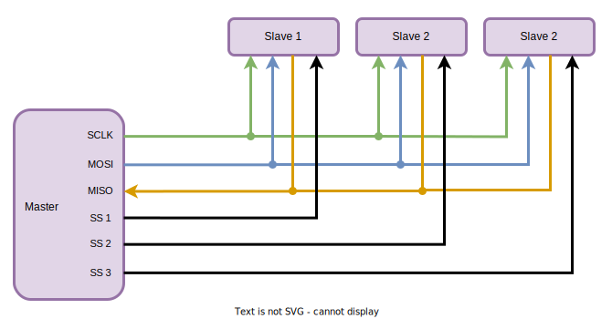
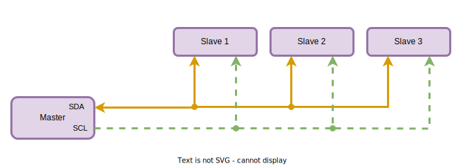
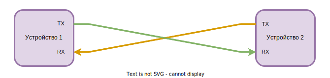

<!-- TOC -->
* [Компонентая архитектура](#компонентая-архитектура)
  * [Требования](#требования)
  * [Компоненты](#компоненты)
    * [Централизованная схема](#централизованная-схема)
    * [Распределенная схема](#распределенная-схема)
  * [Интерфейсы](#интерфейсы)
    * [SPI](#spi)
      * [Количество проводов](#количество-проводов)
      * [Количество устройств](#количество-устройств)
      * [Количество портов на RPI](#количество-портов-на-rpi)
      * [Пропускная способность порта](#пропускная-способность-порта)
    * [I2C](#i2c)
      * [Количество проводов](#количество-проводов-1)
      * [Количество устройств](#количество-устройств-1)
      * [Количество портов на RPI](#количество-портов-на-rpi-1)
      * [Пропускная способность порта](#пропускная-способность-порта-1)
    * [UART](#uart)
      * [Количество проводов](#количество-проводов-2)
      * [Количество устройств](#количество-устройств-2)
      * [Количество портов на RPI](#количество-портов-на-rpi-2)
      * [Пропускная способность порта](#пропускная-способность-порта-2)
    * [USB (UART over USB)](#usb-uart-over-usb)
      * [Количество проводов](#количество-проводов-3)
      * [Количество устройств](#количество-устройств-3)
      * [Количество портов на RPI](#количество-портов-на-rpi-3)
      * [Пропускная способность порта](#пропускная-способность-порта-3)
    * [Итого по интерфейсам](#итого-по-интерфейсам)
  * [Итого по архитектуре](#итого-по-архитектуре)
<!-- TOC -->

# Компонентая архитектура

## Требования

Глобально у нас есть три задачи:

* Сбор информации с различных датчиков
* Анализ состояния системы
* Управление двигателями для изменения положения в пространстве. 

Центральный компонент это блок управления на базе одноплатного компьютера. Будем ориентироваться на RPI5 и Orange PI 5 plus.

На входе у нас могут быть следующие источники информации:

* Камера
* Лидар
* Датчик линии
* Датчик расстояния
* Энкодеры моторов

На выходе мы управляем моторами:

* Драйвер моторов

## Компоненты

### Централизованная схема

При подключении всех компонентов напрямую к центральному блоку мы получаем следующую организацию компонентов:

Такая схема работы имеет ряд недостатков:

* Для работы с периферией часто нужен аналогово-цифровой преобразователь. 
У одноплатников АЦП либо отсутствует, либо имеет ограничения. В Raspberry PI АЦП нет.
* Работа с энкодерами моторов требует формирования импульсов широтно-импульсной модуляции. 
В одноплатниках поддержка шим ограничена. Например, на Raspberry PI есть только два аппаратных канала, остальные программные. 
* Низкоуровневая работа с периферией будет отнимать ресурсы от высокоуровневой работы. 

### Распределенная схема

Для устранения озвученных проблем мы выносим часть логики управления в отдельные компоненты — блок управления моторами и блок датчиков. 

Это позволит нам реализовать низкоуровневое управление с помощью микроконтроллеров, таких как Arduino. 
В микроконтроллерах есть как аппаратная реализация ШИМ, так и АЦП. Таким образом мы получаем гибкую архитектуру 
с возможностью оптимизировать и заменять компоненты внутри блоков без влияния на всю систему. 
При необходимости можно будет менять как одноплатник, так и контроллеры. Например, вместо Arduino можно использовать 
более продвинутые и мощные платы Bluepill или Blackpill на контроллере STM, а вместо малины использовать 
Orange PI 5 plus с нейропроцессором для аппаратного ускорения работы AI и нейросетей.

Получаем децентрализованную схему:

В этом варианте часть устройств подключается напрямую к центральному блоку управления, а остальные к 
контроллерам. Каждый контроллер управлять различным количеством устройств в зависимости от ситуации. 
Количество контроллеров также может меняться.

## Интерфейсы

Мы определили точки взаимодействия между компонентами. Далее необходимо определить физический интерфейс для подключения
устройств и контроллеров. Пока ограничимся описанием для основного блока. Работу контроллеров с устройствами можно 
рассмотреть позднее при детальной проработке внутренней схемы управляемых блоков.

Камеру напрямую подключаем к одноплатнику по интерфейсу CSI (Camera Serial Interface).

Лидар тоже подключаем напрямую через серийный порт UART. Возможно позже это будет изменено. 

Для взаимодействия между контроллерами и одноплатником есть следующие варианты: SPI, UART, USB, I2C. Нам необходимо 
подключить минимум два контроллера, а в будущем возможно и больше поэтому важно это учесть при выборе интерфейса. 
Для нас важны следующие параметры:

* Сложность подключения (количество проводов для подключения, необходимость преобразователей уровней напряжения)
* Количество устройств подключаемых к одному физическому интерфейсу
* Количество физических интерфейсов на RPI и Orange PI
* Пропускная способность 

В части сравнения подключения не будем учитывать питание и GND так как у нас контроллеры в любом случае подключаются 
к этим проводам.

### SPI

#### Количество проводов

Для подключения одного контроллера к одноплатнику по SPI необходимо четыре провода:

* SCK (Serial clock)
* MOSI (Master OUT Slave IN)
* MISO (Master IN Slave OUT)
* CS (Chip select)

При этом каждое устройство использует общие провода SCK, MOSI, MISO и отдельный CS.
То есть количество проводов: 3 + N, где N - количество устройств.

#### Количество устройств

Теоретически можно подключить 128 устройств на один порт.
На практике мы ограничены количеством пинов на одноплатнике и получится подключить порядка 12 устройств.

#### Количество портов на RPI

Один основной (125 Mhz) и пять дополнительных (65 Mhz)

#### Пропускная способность порта

Максимальная: 125 Мбит/с
Реальная: 30-50 Мбит/с

### I2C

#### Количество проводов

Два провода: 

* SDA (Serial data)
* SCL (Serial clock)

#### Количество устройств

Теоретически можно подключить 128 устройств на один порт. 
На практике при увеличении количества устройств на порт, 
скорость уменьшается за счет увеличения емкости шины.

#### Количество портов на RPI

Три физических порта.

#### Пропускная способность порта

* 0.1 Мбит/с (Standard-mode)
* 0.4 Мбит/с (Fast-mode)
* 1 Мбит/с (Fast-mode Plus)
* 3.4 Мбит/с (High-speed mode) 

### UART

#### Количество проводов

Два провода:

* TX (Transmit)
* RX (Receive)

#### Количество устройств

На один порт можно подключить одно устройство.

#### Количество портов на RPI

Шесть портов. Из них четыре аппаратных и два программных.

#### Пропускная способность порта

Максимальная: 1 Мбит/с
Реальная: 0.115 Мбит/с

### USB (UART over USB)

#### Количество проводов

Один кабель USB

#### Количество устройств

127

#### Количество портов на RPI

Четыре порта USB (2 USB 2.0 + 2 USB 3.0)

#### Пропускная способность порта

USB 2.0: 480 Мбит/с (~40-60 UART портов)

### Итого по интерфейсам

По итогам сравнения выглядит оптимальным использовать шину USB c виртуальными UART портами:
* Без UBB хаба можно подключить 4 устройства. Этого достаточно.
* Скорость на каждое устройство будет 1 Мбита в секунду. Достаточно.
* Нет необходимости подключать преобразователи логических уровней.
* Не занимаем пины на GPIO.

## Итого по архитектуре

Итоговая компонентная архитектура:

