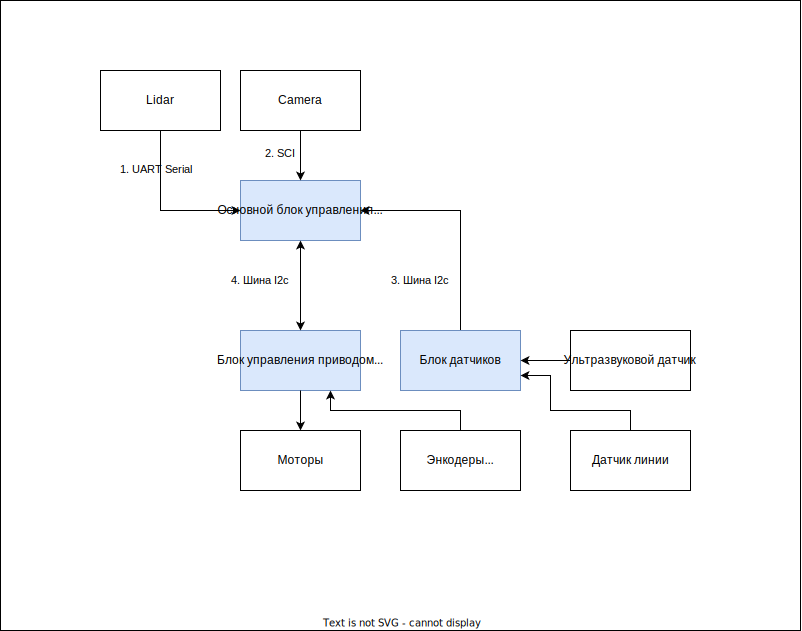

### Шаги

* Логическая диаграмма.
* Описать какая информация передается 
и какие функции у компонентов
* Физическая схема (устройства и электрическая схема) 
* Компоновка в 3D модели

### Верхнеуровневое описание

### Детальное описание

### Компоненты
#### Лидар

Slamtec RPLIDAR A1 2D

Communication interface
RPLIDAR A1 uses 3.3V-TTL serial port (UART) as the communication interface.
Other communication interface such as USB can be customized according to
customer’s requirement. 

* https://www.slamtec.com/en/Lidar/A1
* https://www.slamtec.com/en/Lidar/A1Spec
