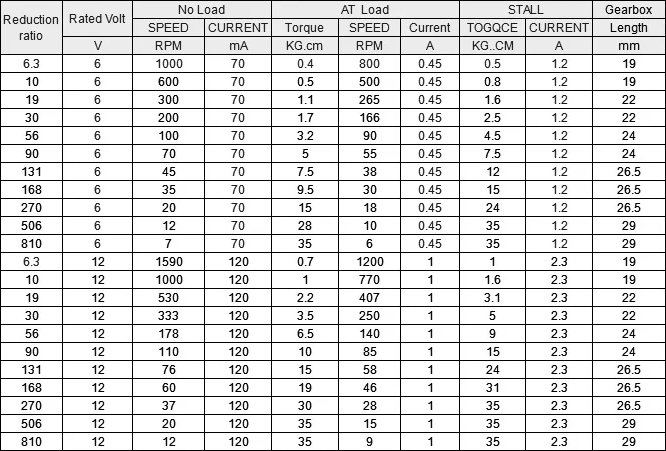
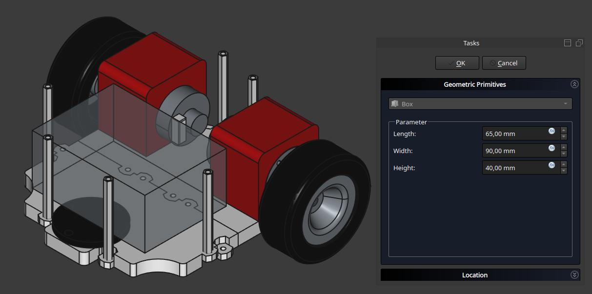
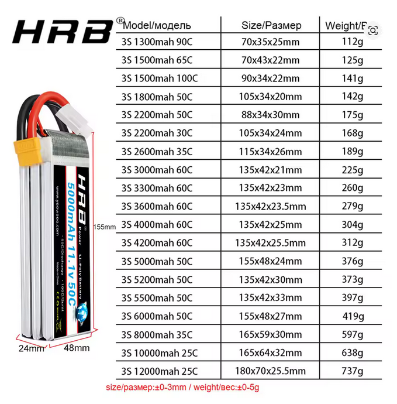
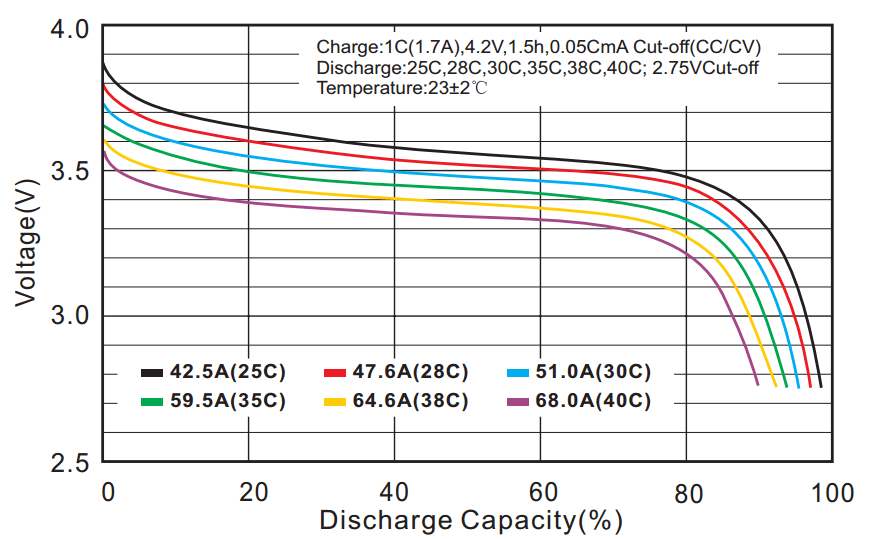
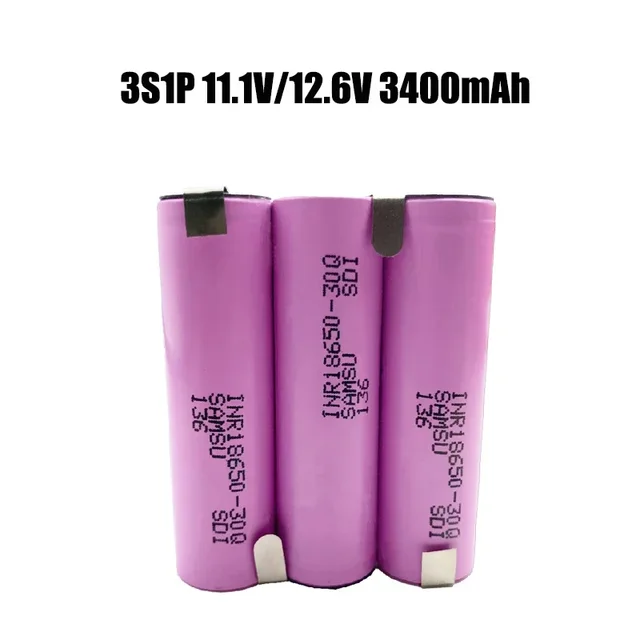
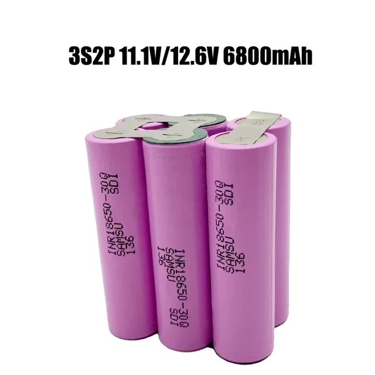

# Схема питания

<!-- TOC -->
* [Схема питания](#схема-питания)
  * [Расчет потребления](#расчет-потребления)
    * [Список потребителей](#список-потребителей)
    * [Параметры потребителей](#параметры-потребителей)
      * [Мотор](#мотор)
      * [Микроконтроллер](#микроконтроллер)
      * [Одноплатный компьютер](#одноплатный-компьютер)
      * [Лидар](#лидар)
      * [Ультразвуковой дальномер](#ультразвуковой-дальномер)
      * [Камера](#камера)
    * [Суммарное потребление](#суммарное-потребление)
  * [Источник питания](#источник-питания)
    * [Параметры аккумулятора](#параметры-аккумулятора)
      * [Вольтаж](#вольтаж)
      * [Размер](#размер)
      * [Емкость](#емкость)
      * [Ток разряда](#ток-разряда)
    * [Выбор аккумулятора](#выбор-аккумулятора)
      * [LiPo](#lipo)
        * [Особенности](#особенности)
        * [Параметры](#параметры)
        * [Выбор модели](#выбор-модели)
        * [Зарядка](#зарядка)
        * [Защита от переразряда](#защита-от-переразряда)
      * [LiIo](#liio)
  * [Преобразователи напряжения](#преобразователи-напряжения)
  * [Электрическая схема](#электрическая-схема)
<!-- TOC -->

Для питания компонентов бота нам необходимо выбрать источник питания - аккумулятор с
подходящими параметрами.

Помимо источника питания могут понадобиться преобразователи уровня напряжения так как
разные потребители могут использовать различные уровни напряжения.

## Расчет потребления

### Список потребителей

| Потребитель           | Параметры/модель                                                                        | Количество |
|-----------------------|-----------------------------------------------------------------------------------------|------------|
| Мотор                 | JGB37-520 encoder motor Smart car motor DC 12V small motor car kit speed motor. 178 RPM | 2          |
| Микрокотроллер        | Arduino Nano 3.0 Mini                                                                   | 2          |
| Одноплатный компьютер | RPI 4 Model B                                                                           | 1          |
| Лидар                 | Xiaomi Mijia STYTJ02YM                                                                  | 1          |
| Ультразвуковой датчик | HY-SRF04 SRF04 Ultrasonic Distance Sensor                                               | 1          |
| Камера                | Pi Camera Module 3                                                                      | 1          |

### Параметры потребителей

#### Мотор

Справочная информация по потреблению тока мотором:

В нашем случае строка 12V, 178 RPM. 
Под нагрузкой: 1A, стопор: 2.3A

| Модель       | Min | Max  | Average |
|--------------|-----|------|---------|
| 12V, 178 RPM | 1A  | 2.3A | 1.5A    |

#### Микроконтроллер

Потребление без учета периферии:

| Модель | Min   | Max   | Average |
|--------|-------|-------|---------|
| Nano   | 20 mA | 80 mA | 30 mA   |

Максимальный ток с периферией может быть 380mA, но всю периферию мы считаем отдельно 
поэтому учитывать в потреблении не будем.

#### Одноплатный компьютер

| Модель                 | Min | Max | Average |
|------------------------|-----|-----|---------|
| Raspberry Pi 4 Model B | 1A  | 3A  | 2A      |
| Raspberry Pi 5         | 1A  | 3A  | 2A      |
| Orange PI 6 Plus       | 1A  | 3A  | 2A      |

Максимальный ток с периферией для RPI 5 может быть 5A, но всю периферию мы считаем отдельно
поэтому учитывать в потреблении не будем.

#### Лидар

Потребление лидара постоянное 350mA ([Источник](https://www.youtube.com/watch?v=S_xONJO4-Q0))

#### Ультразвуковой дальномер

Потребление дальномера постоянное 15mA

#### Камера

| Модель                       | Min   | Max   | Average |
|------------------------------|-------|-------|---------|
| Raspberry Pi Camera Module 3 | 220mA | 600mA | 450mA   |

### Суммарное потребление

Для расчетов будем использовать максимальные токи для 
каждого потребителя, чтобы гарантировать надежную работу самом экстремальном режиме:

| Потребитель           | Напряжение | Ток средний | Ток максимальный |
|-----------------------|------------|-------------|------------------|
| Мотор                 | 12V        | 1.5         | 2.3А             |
| Мотор                 | 12V        | 1.5         | 2.3А             |
| Микроконтроллер       | 5V         | 30mA        | 80mА             |
| Микроконтроллер       | 5V         | 30mA        | 80mА             |
| Одноплатный компьютер | 5V         | 2A          | 3A               |
| Лидар                 | 5V         | 300mA       | 300mА            |
| Ультразвуковой датчик | 5V         | 15mA        | 15mA             |
| Камера                | 5V         | 450mA       | 600mA            |

Итого мы получаем:

Максимальная мощность:
* Напряжение: 12V, максимальный длительный ток: 4.6А (силовая)
* Напряжение: 5V, максимальный длительный ток: 4А (электроника)
* Общая мощность: 12V*4.6А + 5V*4А = 75вт; с запасом 85вт

Средняя мощность: 

* Напряжение: 12V, ток: 3А (силовая)
* Напряжение: 5V, ток: 2.5А (электроника)
* Общая мощность: 12V*3А + 5V*2.5А = 51 вт; с небольшим запасом 55вт

## Источник питания
### Параметры аккумулятора

Критерии выбора:
* Вольтаж
* Размер
* Емкость
* Ток разряда (C-рейтинг)

#### Вольтаж

У нас два напряжения потребителей 5 и 12 вольт. Причем 12 вольт напряжения питания приводов. 
Для 5 вольтовых потребителей в любом случае нужен будет адаптер.
Для 12 вольтовых потребителей желательно обойтись без адаптера.

Оптимальный вариант аккумулятор на 12v

#### Размер

Для комфортного размещения в корпусе бота нам нужно уложиться в размеры 90x65x40 мм:

#### Емкость

Емкость будет определять время работы от одной зарядки.
Так как у нас потребляется разное напряжение будем проводить расчеты в ваттах ватт/часах.

Ранее мы посчитали среднее потребление и получили 55 ватт.
Емкость аккумуляторов обычно указывается в мАч, поэтому приведем к мАч:

Ватт в час = U*I в час. Размерность В*А в час 
mA в час = Ватты*1000/U в час = 55*1000/12 = 4584 мА в час

То есть для работы от одной зарядки в течение часа нам потребуется аккумулятор емкостью 4.584 мАч. 

Минимальное время работы от одной зарядки определим в 30 минут. Поэтому емкость аккумулятора должна быть не 
менее 2200 mAh.

#### Ток разряда

Средняя потребляемая мощность 55 ватт при напряжении 12 вольт.
Средний ток разряда 55/12 = 4.6А. 
Максимальная потребляемая мощность 85 ватт при напряжении 12 вольт.
Максимальный ток разряда 85/12 = 7А. С учетом запаса ток разряда должен быть не менее 15А.
Итого: ток длительного разряда должен быть не менее 15 ампер.

Ток разряда определяется параметром С-рейтинг.

Посчитаем с-рейтинг для аккумулятора 2200 mAh и потребления 10А:
* 15A/2.2A = 7C 

Итого: ток разряда должен быть 15А(рейтинг 7C или выше)

### Выбор аккумулятора

* 95x65x40
* 12v 
* от 2200 mAh
* от 15A (7c)

Под наши требования подходят два варианта аккумуляторов:

* LiPo аккумуляторы
* LiIon аккумуляторы

Вольтаж аккумуляторов изменяется количеством последовательно соединенных ячеек - 1S,2S,3S и т.д.
Для увеличения тока разряда аккумуляторные ячейки соединяются параллельно - 1P,2P,3P и т.д.

Остальные варианты аккумуляторов не подходят из-за малых токов разряда (NiMH) или больших размеров(свинцовые)

#### LiPo

##### Особенности
Особенности LiPo аккумуляторов:

* Большая вариативность форм, ёмкости, вольтажа. 
* Выдают большие токи 30-100С. 
* Относительно малые габариты и вес. 
* Требуют осторожности в использовании так упакованы в мягкий корпус.

##### Параметры
Итого нам нужен LiPo аккумулятор: 
* 3S(~12v)
* от 2200mAh
* менее 95 мм в длину 
* менее 65x40 мм в сечении.    

##### Выбор модели
Выбираем 3S аккумулятор из таблицы:

Под наши критерии полностью подходит только один вариант:

* 3S 2200mAh 50C (88x34x30)

Ток разряда 50С это 110А. Для нашей задачи огромный запас.
Емкость 2200mAh это минимальная граница, но в целом подходит.

##### Зарядка

##### Защита от переразряда
Литиевые аккумуляторы повреждаются при сильном разряде.

Сводная таблица напряжений для LiPo 3S с процентом разряда:

| Состояние                                      | Напряжение всего аккумулятора | Напряжение на банке | **Примерный % остатка** | Примечание                                            |
|:-----------------------------------------------|:------------------------------|:--------------------|:------------------------|:------------------------------------------------------|
| **Полный заряд**                               | 12.6 В                        | 4.20 В              | **100%**                | Максимум для зарядки                                  |
| **Начало рабочего разряда**                    | ~12.2 В                       | ~4.07 В             | **~80%**                | Быстрый спад под нагрузкой, норма                     |
| **Середина разряда**                           | ~11.7 В                       | ~3.90 В             | **~60%**                | Стабильная рабочая зона                               |
| **Рекомендуемый предел для остановки**         | **~11.1 В**                   | **~3.70 В**         | **~20%**                | **Самое время заканчивать работу!**                   |
| **Начало "обрыва"**                            | ~10.8 В                       | ~3.60 В             | **~10%**                | Опасная зона! Напряжение начнет падать очень быстро   |
| **Критический разряд (Стоп!)**                 | **9.6 В**                     | **3.2 В**           | **~0%**                 | Жесткий предел, дальше нельзя. Аккумулятор поврежден. |
| **Абсолютный минимум (Убийство аккумулятора)** | 9.0 В                         | 3.0 В               | **-**-                  | Необратимое повреждение, опасность возгорания         |

График разряда:

Для защиты от переразряда можно использовать измеритель напряжения со звуковым сигналом. При 
достижении заданной точки устройство пищит и мигает светодиодами.
Учитывая, что у нас не коптер и есть возможность оперативно отключить бота, 
можно ставить отсечку на 3.5 вольта на банку. Общее напряжение использовать нельзя 
так как может быть перекос и какая-то банка сильно разрядится.

When you use the battery for Remote Control Drone, Car, Truck, Boat, Helicopter. Don't let the battery voltage more 
than 4.2V caused overcharge and 
Don't let the battery voltage below 3.7V caused over discharge.

| Компонент           | Модель                                                                                                                          | Картинка                                                                                                                                            |
|---------------------|---------------------------------------------------------------------------------------------------------------------------------|-----------------------------------------------------------------------------------------------------------------------------------------------------|
| Аккумулятор         | HRB 3S LiPo Battery 11.1V 2200mAh 50C for RC Car with Deans Plug XT60 Connector For RC Car Helicopter Drone Boat Airplane       |  |
| Защита аккумулятора | 1pcs or 4pcs Hot Sell 2s 2s 3s 4s 5s 6s 7s 8S 1-8S LED Low Voltage Buzzer Alarm Lipo Voltage Indicator Checker Tester Wholesale |    | | 

#### LiIo

Есть еще вариант использовать сборку из LiIo аккумуляторов 3S2P. Для зарядки можно использовать
3S BMS 12.6V 40A или вывести балансировочные провода для зарядника по аналогии с LIPO.
Этот вариант требует сварки ячеек никелевой лентой и будет рассмотрен отдельно. В целом этот вариант
имеет и преимущества в том, что Li Ion аккумуляторы более безопасны и суммарная емкость больше.

1. LiIo аккумуляторы (INR18650-30Q)

## Преобразователи напряжения
Понижающий DC-DC Step Down преобразователь XL4005
Понижающий DC-DC Step Down преобразователь XL4015

UBEC-5A
Voltage 5.5V-35V (2-8S LIPO)
Continuous Current: 5A
Instantaneous current: 6A 20 sec
Output voltage: 5.25V +/- 0.5V
Dimensions: 43 * 21 * 1mm   
Product Weight: 18g

Получаем потребление в районе 5 ампер
## Электрическая схема