<!-- TOC -->
  * [Шасси](#шасси)
    * [Исходные данные](#исходные-данные)
    * [3D модели компонентов](#3d-модели-компонентов)
      * [Мотор](#мотор)
      * [Колеса](#колеса)
      * [Роликовое колесо](#роликовое-колесо)
      * [Основание](#основание)
      * [Крепление мотора](#крепление-мотора)
    * [Итоговая 3D модель](#итоговая-3d-модель)
    * [Реализация](#реализация)
    * [Список компонентов](#список-компонентов)
<!-- TOC -->

## Шасси

### Исходные данные
* У нас есть базовая деталь для основания шасси.
* По размеру подходят моторы и колеса.

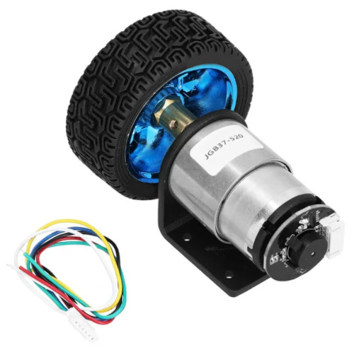

* В качестве переднего ролика можно использовать мебельный ролик.

Понятно, что базовая деталь нам не подходит и нужно делать свою реализацию.
Для компоновки нам понадобятся 3D модели всех компонентов.

### 3D модели компонентов

#### Мотор

#### Колеса

#### Роликовое колесо

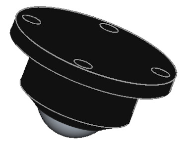

#### Основание

#### Крепление мотора

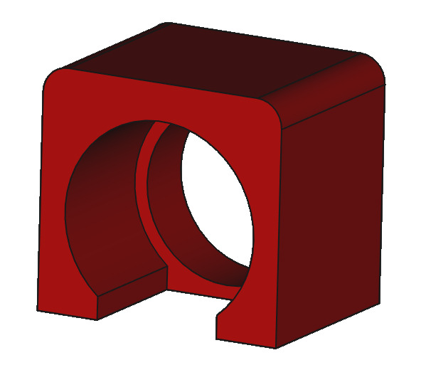

### Итоговая 3D модель

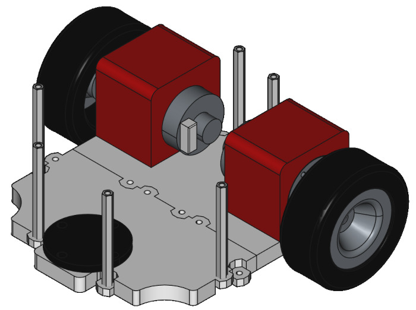

### Реализация

Крепления моторов фиксируем на основании с помощью цианоакрилатного клея COSMOFEN.
Ролик я приклеил на тонкий двухсторонний скотч. В целом можно использовать любой способ крепления.
Моторы входят очень плотно и нет необходимости в креплении винтами.

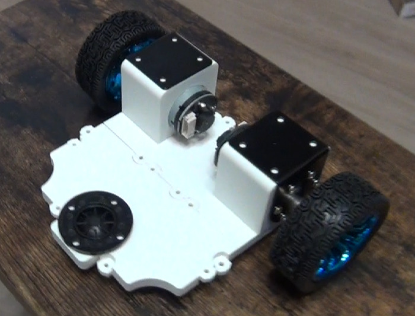

### Список компонентов

| Компонент                    | Реализация                                                                                                                      | 3D Модель                                     |
|------------------------------|---------------------------------------------------------------------------------------------------------------------------------|-----------------------------------------------|
| Мотор с энкодером            | JGB37-520 encoder motor Smart car motor DC 12V small motor car kit speed motor                                                  | 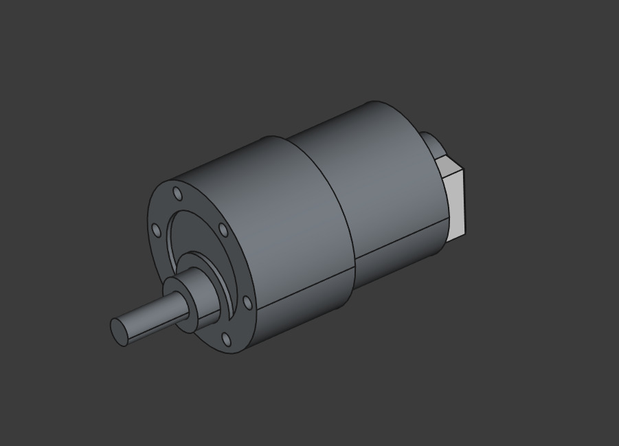                 |
| Роликовое колесо             | Self Adhesive Caster Mini Swivel Wheels Stainless Steel Universal Wheel 360 Degree Rotation Pulley for Furniture Trash Can      | 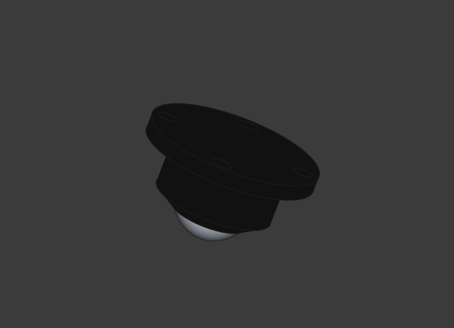   |
| Колесо                       | Car Model 65MM Tyre Big Friction Wheel Toy Intelligent Car Robot Wheel Wheel DIY                                                | 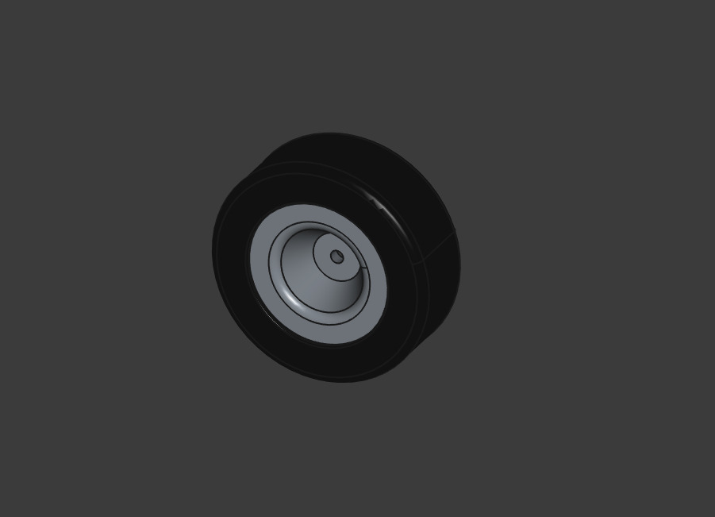                 |
| Стойка 35mm,55m(35+20)       | Solid Brass Copper M3 Hex Standoff Hexagon Pillar F-F Female-Female Spacer for PCB Board Motherboard                            | 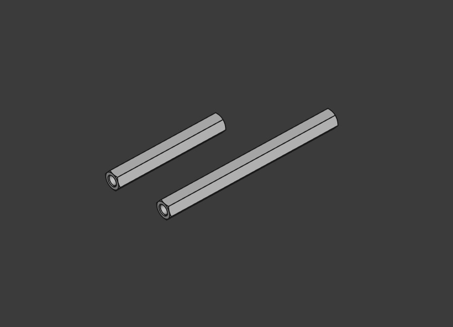           |
| Основание шасси              | 3D печать ([3D модели](https://github.com/makarov-na/turtle-bot-3d-models))                                                     | 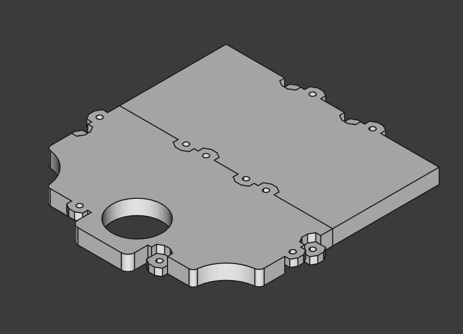       |
| Крепление мотора             | 3D печать ([3D модели](https://github.com/makarov-na/turtle-bot-3d-models))                                                     | 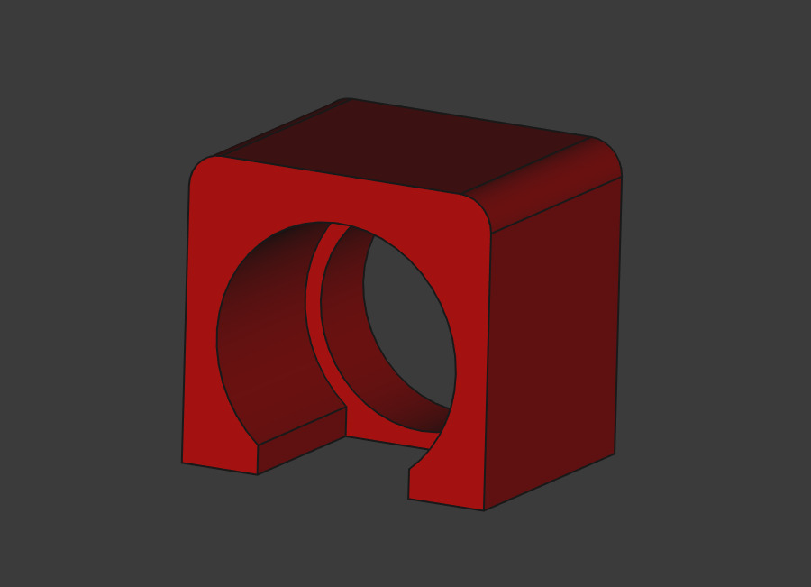 |
