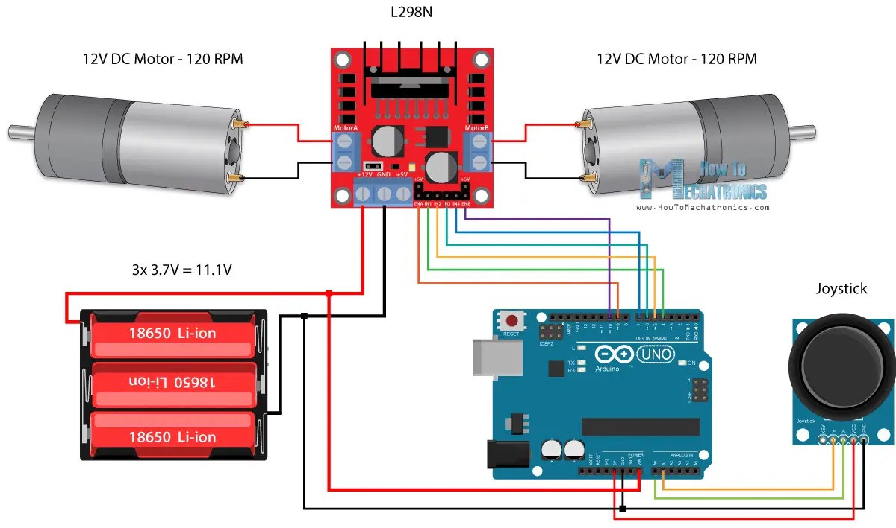

На логической диаграмме расписать все точки интеграции подробно.
Сейчас не до конца понятно разграничение между основным блоком и
блоком управления приводом.

* Уровень мощности 0-100 для каждого колеса
* Скорость вращения колеса.
* Скорость движения и угол поворота - не всегда можем знать
    * Какой смысл при движении?
    * При нулевой скорости сможем точно повернуть
* Скорость движения и угловую скорость - скорость поворота зависит от ошибки
* Скорость движения и угол отклонения

Зачем использовать энкодеры? Можно же и без них.
* Измерять точно скорость вращение мотора
* Зная скорость вращения мы можем делать точные повороты на нужный градус
* Можем точно посчитать/задать угловую скорость
* Можем точно посчитать/задать скорость
* Можно построить точную кинематическую модель двухколесного дифференциального привода

Сценарии использования

Более производительная альтернатива Arduino Blue pill STM32F103

| Интерфейс | Кол-во проводов (на 2 Arduino) | Скорость (Мбит/с) | Сложность подключения | ROS-совместимость | Примечания |
|-----------|--------------------------------|-------------------|------------------------|-------------------|------------|
| **UART**  | 4 + 2*GND (если отдельные UART) | 0.115 (на порт)   | Высокая (аппаратные порты ограничены, нужны преобразователи уровней) | ✅ (rosserial) | На Pi 3 только один аппаратный UART. Для двух Arduino: использовать USB-UART адаптеры (фактически переход на USB). |
| **I2C**   | 2 (SDA, SCL) + GND             | 0.4               | Средняя (требует преобразователь уровней и подтяжки) | ⚠️ (требует кастомный код) | Уникальные адреса для каждого Arduino. |
| **SPI**   | 3 (MOSI, MISO, SCK) + 2*CS + GND | 4-6               | Высокая (много проводов, преобразователь уровней) | ⚠️ (требует кастомный код) | Для каждого Arduino свой CS. |
| **USB**   | 2 кабеля (каждый: D+, D-, GND, VCC) | 8-10 (на порт)    | Низкая (просто подключить) | ✅ (rosserial) | Не требует дополнительных схем. |

Детали:
1. **UART**:
  - Если использовать аппаратный UART Raspberry Pi (GPIO14/15) для одного Arduino, то для второго придется использовать USB-UART адаптер (фактически USB) или программный UART (нестабильный).
  - Провода: для каждого UART-устройства: TX, RX, GND (итого 4 сигнальных + 2 GND, но GND можно общую). Но если использовать USB-UART, то это уже USB.
2. **I2C**:
  - Провода: SDA, SCL, GND (общая) — всего 3 провода для двух устройств.
  - Требует преобразователь уровней 3.3V<->5V (так как Arduino 5V, а Pi 3.3V) и подтягивающие резисторы (4.7 кОм к 3.3V).
  - В ROS нет нативной поддержки множественных Arduino по I2C, придется писать свой узел на Pi, который будет общаться с обеими Arduino и публиковать/принимать данные в ROS.
3. **SPI**:
  - Провода: общие MOSI, MISO, SCK, а для каждого устройства отдельный CS (выбор устройства). Итого 3 общих + 2*CS + GND (общая) = 5 проводов + GND.
  - Также требуется преобразователь уровней (SPI работает на более высоких скоростях, поэтому преобразователь обязателен).
  - В ROS нет прямой поддержки, нужен кастомный узел.
4. **USB**:
  - Каждое Arduino подключается отдельным USB-кабелем (внутри: D+, D-, GND, +5V). Raspberry Pi обеспечивает питание (если хватает тока) или можно использовать внешний хаб.
  - ROS: отличная поддержка через `rosserial_arduino` (каждое Arduino видно как отдельный ROS-узел).
  - Скорость: USB 2.0 Full Speed (12 Мбит/с), реальная пропускная способность около 8-10 Мбит/с на порт.

Выводы:
- **USB** — самый простой и надежный вариант для двух Arduino. Не требует дополнительных компонентов, легко подключается, отличная поддержка в ROS.
- **I2C** — экономит провода, но требует преобразователь уровней и кастомный код для ROS.
- **SPI** — высокая скорость, но много проводов и сложная разводка.
- **UART** — непрактично для двух устройств на Raspberry Pi 3 (из-за ограниченности аппаратных портов).
-  
- Рекомендация: **использовать USB**.

Схема подключения двух устройств Arduino Nano к Raspberry Pi 3 по I²C
Важно: Для безопасного подключения используется двунаправленный преобразователь уровней I²C (например, на BSS138), так как Raspberry Pi работает на 3.3V, а Arduino на 5V.

                      +-----------------+  
                      | Raspberry Pi 3  |  
                      |                 |  
                      | GPIO2 (SDA) <---|------------------+  
                      | GPIO3 (SCL) <---|------------------|--+  
                      | GND (Pin 9) <---|------------------|--|--+  
                      +-----------------+                  |  |  |  
                                                           |  |  |  
              +---------------------+                      |  |  |  
              | Преобразователь     |                      |  |  |  
              | уровней (3.3V ↔ 5V) |                      |  |  |  
              |                     |                      |  |  |  
              | LV1 (SDA) <---------+                      |  |  |  
              | LV2 (SCL) <---------|----------------------+  |  |  
              | GND <---------------|-----------------------|-+  |  
              |                     |                         |  |  
              | HV1 (SDA) ----------|-------------------------+  |  
              | HV2 (SCL) ----------|----------------------------+  
              | HV (5V) <-----------|-----------------------------+  
              | GND <---------------|-----------------------------|--+  
              +---------------------+                             |  |  
                                                                 |  |  
      +----------------+                    +----------------+   |  |  
      | Arduino Nano 1 |                    | Arduino Nano 2 |   |  |  
      |                |                    |                |   |  |  
      | A4 (SDA) <-----|--------------------+                |   |  |  
      | A5 (SCL) <-----|--------------------|---------------+   |  |  
      | GND <----------|--------------------|-------------------|--+  
      |                |                    |                |      |  
      +----------------+                    +----------------+      |  
                                                                    |  
+------------------------------------------------------------------+  
|  
+------> Внешний источник 5V (стабильный)  