<!-- TOC -->
  * [Расчёт потребления](#расчёт-потребления)
    * [Список потребителей](#список-потребителей)
    * [Параметры потребителей](#параметры-потребителей)
      * [Мотор](#мотор)
      * [Микроконтроллер](#микроконтроллер)
      * [Одноплатный компьютер](#одноплатный-компьютер)
      * [Лидар](#лидар)
      * [Ультразвуковой дальномер](#ультразвуковой-дальномер)
      * [Камера](#камера)
    * [Суммарное потребление](#суммарное-потребление)
  * [Источник питания](#источник-питания)
    * [Параметры аккумулятора](#параметры-аккумулятора)
      * [Вольтаж](#вольтаж)
      * [Размер](#размер)
      * [Ёмкость](#ёмкость)
      * [Ток разряда](#ток-разряда)
    * [Выбор аккумулятора](#выбор-аккумулятора)
      * [Li-Po](#li-po)
        * [Особенности](#особенности)
        * [Параметры](#параметры)
        * [Выбор модели](#выбор-модели)
        * [Зарядка](#зарядка)
        * [Защита от переразряда](#защита-от-переразряда)
      * [Li-Ion](#li-ion)
        * [Особенности](#особенности-1)
        * [Параметры](#параметры-1)
        * [Выбор модели](#выбор-модели-1)
        * [Сборка](#сборка)
          * [Сварка](#сварка-)
          * [Батарейный отсек](#батарейный-отсек)
          * [Без защиты](#без-защиты)
          * [С защитой](#с-защитой)
    * [Итого по источнику питания](#итого-по-источнику-питания)
  * [Преобразователи напряжения](#преобразователи-напряжения)
    * [Параметры](#параметры-2)
      * [Понижающий DC-DC Step Down преобразователь LM2596](#понижающий-dc-dc-step-down-преобразователь-lm2596)
      * [Понижающий DC-DC Step Down преобразователь XL4005/XL4015](#понижающий-dc-dc-step-down-преобразователь-xl4005xl4015)
      * [Понижающий DC-DC Step Down преобразователь XL4016E1](#понижающий-dc-dc-step-down-преобразователь-xl4016e1)
      * [UBEC-7A](#ubec-7a)
      * [Понижающий DC-DC Buck преобразователь Cedar 10A](#понижающий-dc-dc-buck-преобразователь-cedar-10a)
    * [Итого по преобразователям](#итого-по-преобразователям)
  * [Электрическая схема](#электрическая-схема)
  * [3D Модель](#3d-модель)
  * [Реализация](#реализация)
  * [Список компонентов](#список-компонентов)
  * [Ссылки](#ссылки)
<!-- TOC -->

Для питания компонентов бота нам необходимо выбрать источник питания - аккумулятор с
подходящими параметрами.

Помимо источника питания могут понадобиться преобразователи уровня напряжения, так как
разные потребители могут использовать различные напряжения для питания.

## Расчёт потребления

Для каждого потребителя необходимо определить напряжение и ток. Имея эти данные получим общую потребляемую мощность для
расчёта параметров источника питания.

### Список потребителей

| Потребитель           | Параметры/модель                                                                        | Количество |
|-----------------------|-----------------------------------------------------------------------------------------|------------|
| Мотор                 | JGB37-520 encoder motor Smart car motor DC 12V small motor car kit speed motor. 178 RPM | 2          |
| Микроконтроллер       | Arduino Nano 3.0 Mini                                                                   | 2          |
| Одноплатный компьютер | RPI 4 Model B                                                                           | 1          |
| Лидар                 | Xiaomi Mijia STYTJ02YM                                                                  | 1          |
| Ультразвуковой датчик | HY-SRF04 SRF04 Ultrasonic Distance Sensor                                               | 1          |
| Камера                | Pi Camera Module 3                                                                      | 1          |

### Параметры потребителей

#### Мотор

Справочная информация по потреблению тока мотором:
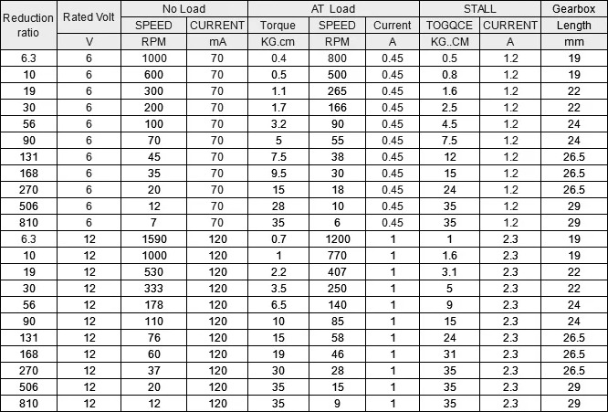

В нашем случае строка 12V, 178 RPM. 

Под нагрузкой: 1A, стопор: 2.3A

| Модель       | Min | Max  | Average |
|--------------|-----|------|---------|
| 12V, 178 RPM | 1A  | 2.3A | 1.5A    |

#### Микроконтроллер

Напряжение 5V (при наличии стабилизатора напряжения)

Потребление без учёта периферии:

| Модель | Min   | Max   | Average |
|--------|-------|-------|---------|
| Nano   | 20 mA | 80 mA | 30 mA   |

Максимальный ток с периферией может быть 380mA, но всю периферию мы считаем отдельно,
поэтому учитывать в потреблении не будем.

#### Одноплатный компьютер

Напряжение 5V

| Модель                 | Min | Max | Average |
|------------------------|-----|-----|---------|
| Raspberry Pi 4 Model B | 1A  | 3A  | 2A      |
| Raspberry Pi 5         | 1A  | 3A  | 2A      |
| Orange PI 6 Plus       | 1A  | 3A  | 2A      |

Максимальный ток с периферией для RPI 5 может быть 5A, но всю периферию мы считаем отдельно,
поэтому учитывать в потреблении не будем.

#### Лидар

Напряжение 5V

Потребление лидара постоянное 350 mA ([Источник](https://www.youtube.com/watch?v=S_xONJO4-Q0))

#### Ультразвуковой дальномер

Напряжение 5V

Потребление дальномера постоянное 15mA

#### Камера

Напряжение 5V

| Модель                       | Min   | Max   | Average |
|------------------------------|-------|-------|---------|
| Raspberry Pi Camera Module 3 | 220mA | 600mA | 450mA   |

### Суммарное потребление

Для расчётов будем использовать максимальные токи для 
каждого потребителя, чтобы гарантировать надежную работу в самом экстремальном режиме:

| Потребитель           | Напряжение | Ток средний | Ток максимальный |
|-----------------------|------------|-------------|------------------|
| Мотор                 | 12V        | 1.5         | 2.3A             |
| Мотор                 | 12V        | 1.5         | 2.3A             |
| Микроконтроллер       | 5V         | 30mA        | 80mA             |
| Микроконтроллер       | 5V         | 30mA        | 80mA             |
| Одноплатный компьютер | 5V         | 2A          | 3A               |
| Лидар                 | 5V         | 350mA       | 350mA            |
| Ультразвуковой датчик | 5V         | 15mA        | 15mA             |
| Камера                | 5V         | 450mA       | 600mA            |

Итого мы получаем:

Максимальная мощность:
* Напряжение: 12V, максимальный длительный ток: 4.6A (силовая)
* Напряжение: 5V, максимальный длительный ток: 4.1A (электроника)
* Общая мощность: 12V*4.6A + 5V*4.1A = 75.7 Вт; с запасом 85 Вт

Средняя мощность: 

* Напряжение: 12V, ток: 3A (силовая)
* Напряжение: 5V, ток: 2.9A (электроника)
* Общая мощность: 12V*3A + 5V*2.9A = 50.5 Вт; с небольшим запасом 55 Вт

## Источник питания
### Параметры аккумулятора

Критерии выбора:
* Вольтаж
* Размер
* Емкость
* Ток разряда (C-рейтинг)

#### Вольтаж

У нас два напряжения потребителей 5 и 12 вольт. Причем 12 вольт напряжение питания приводов. 
В любом случае нам нужно использовать адаптер напряжения для какой-то из групп потребителей. 
Выглядит оптимальным 5 вольтовых потребителей использовать понижающий преобразователь напряжения,
а для 12-вольтовых потребителей хотелось бы обойтись без адаптера.

Поэтому нужен аккумулятор на 12 V

#### Размер

Для комфортного размещения в корпусе бота нам нужно уложиться в размеры 90x65x40 мм:

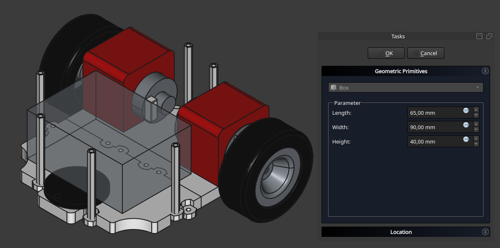

#### Ёмкость

Ёмкость будет определять время работы от одной зарядки.
Так как у нас потребляется разное напряжение, будем проводить расчёты в ватт-часах.

Ранее мы посчитали среднее потребление и получили 55 ватт.
Ёмкость аккумуляторов обычно указывается в мА·ч, поэтому приведём к мА·ч:

Мощность за час: U·I. Размерность В·А·ч.

Ампер-часы: мА·ч ≈ Вт·1000/U = 55·1000/12 = 4584 мА·ч

То есть для работы от одной зарядки в течение часа нам потребуется аккумулятор ёмкостью 4584 мА·ч.

Минимальное время работы от одной зарядки определим в 30 минут. Поэтому ёмкость аккумулятора должна быть не
менее 2300 mAh.

#### Ток разряда

* Средняя потребляемая мощность 55 ватт 
* При напряжении питания 12 вольт получаем средний ток разряда 55/12 = 4.6A.
* Максимальная потребляемая мощность 85 ватт.
* Максимальный ток разряда 85/12 = 7A. 

Если использовать аккумуляторы с максимальным током разряда 7А, то не будет запаса на рост или какие-то непредвиденные ситуации.
Для надежной работы заложим двойной запас по току разряда - 15A. 

Итого: ток длительного разряда должен быть не менее 15 ампер.

Ток разряда определяется параметром C-рейтинг.

Посчитаем C-рейтинг для аккумулятора 2200 mAh и потребления 15A:
* 15A/2.2Ah = 7C (округлено)

Итого: ток разряда должен быть 15A (рейтинг 7C или выше)

### Выбор аккумулятора

Параметры:
* 90x65x40
* 12 V
* от 2200 mAh
* от 15A (7C)

Под наши требования подходят два варианта аккумуляторов:

* LiPo аккумуляторы
* LiIon аккумуляторы

Вольтаж аккумуляторов изменяется количеством последовательно соединенных ячеек - 1S, 2S, 3S и т.д.
Для увеличения тока разряда аккумуляторные ячейки соединяются параллельно - 1P, 2P, 3P и т.д.
Остальные варианты аккумуляторов не подходят из-за малых токов разряда (NiMH) или больших размеров (свинцовые)

#### Li-Po

##### Особенности

Особенности LiPo аккумуляторов:

* Большая вариативность форм, ёмкости, вольтажа. 
* Выдают большие токи 30–100C. 
* Относительно малые габариты и вес. 
* Требуется обязательно защита от переразряда. 
* Требуют осторожности в использовании, так как упакованы в мягкий корпус.

##### Параметры
Итого нам нужен LiPo аккумулятор: 
* 3S(~12v)
* от 2200mAh
* менее 90 мм в длину 
* менее 65x40 мм в сечении.    

##### Выбор модели
Выбираем 3S аккумулятор из таблицы:

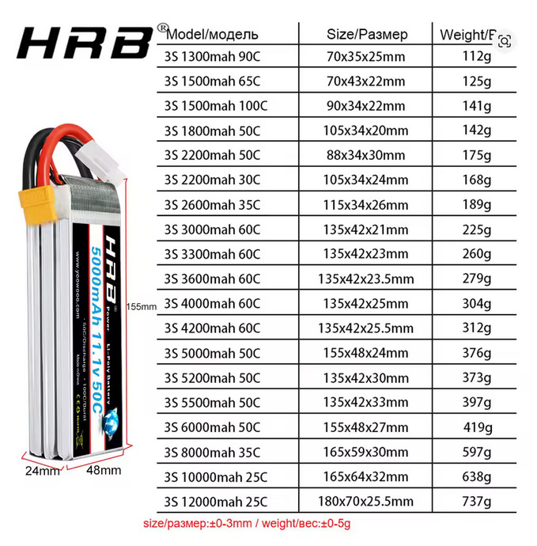

Под наши критерии полностью подходит только вариант 3S 2200 mAh 50C (88x34x30)

* По размерам проходит.
* Ток разряда 50C — это 110A. Для нашей задачи огромный запас.
* Емкость 2200 mAh - это минимальная граница, но в целом подходит.

##### Зарядка

Для заряда необходимо использовать зарядное устройство с функцией балансировки заряда.

Подходит универсальное зарядное устройство IMAX B6/B6AC:

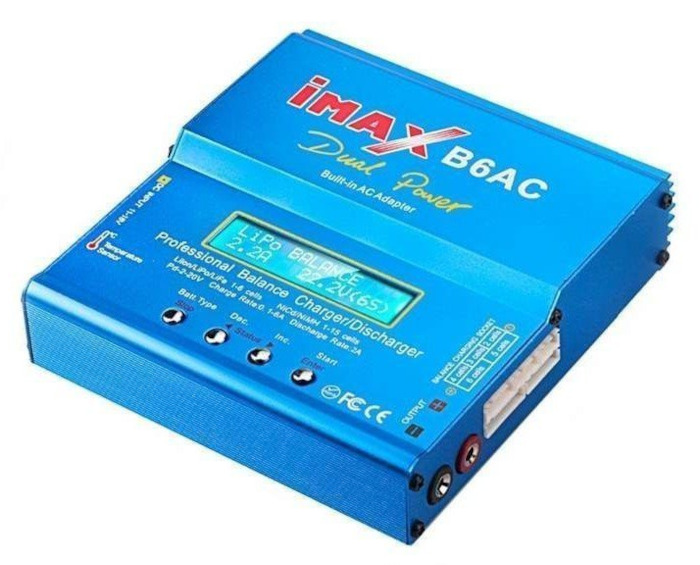

##### Защита от переразряда
Литиевые аккумуляторы повреждаются при сильном разряде.

Сводная таблица напряжений для LiPo 3S с процентом разряда:

| Состояние                                      | Напряжение всего аккумулятора | Напряжение на банке | **Примерный % остатка** | Примечание                                            |
|:-----------------------------------------------|:------------------------------|:--------------------|:------------------------|:------------------------------------------------------|
| **Полный заряд**                               | 12.6 В                        | 4.20 В              | **100%**                | Максимум для зарядки                                  |
| **Начало рабочего разряда**                    | ~12.2 В                       | ~4.07 В             | **~80%**                | Быстрый спад под нагрузкой, норма                     |
| **Середина разряда**                           | ~11.7 В                       | ~3.90 В             | **~60%**                | Стабильная рабочая зона                               |
| **Рекомендуемый предел для остановки**         | **~11.1 В**                   | **~3.70 В**         | **~20%**                | **Самое время заканчивать работу!**                   |
| **Начало "обрыва"**                            | ~10.8 В                       | ~3.60 В             | **~10%**                | Опасная зона! Напряжение начнет падать очень быстро   |
| **Критический разряд (Стоп!)**                 | **9.6 В**                     | **3.2 В**           | **~0%**                 | Жесткий предел, дальше нельзя. Аккумулятор поврежден. |
| **Абсолютный минимум (Убийство аккумулятора)** | 9.0 В                         | 3.0 В               | **—**                   | Необратимое повреждение, опасность возгорания         |

График разряда:

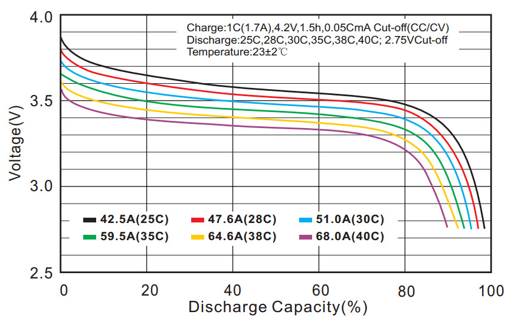

Для защиты от переразряда в идеале нужно использовать плату BMS, но для LiPo аккумуляторов допустимо не использовать BMS
и полагаться на индикаторы в виде измерителя напряжения со звуковым сигналом. При достижении минимального порога
напряжения на элементе аккумулятора устройство пищит и мигает светодиодами.
Учитывая, что у нас не коптер и есть возможность оперативно отключить бота,
можно ставить отсечку на 3.5 вольта на банку. Общее напряжение использовать нельзя,
так как может быть перекос и какая-то банка сильно разрядится.

Устройство для защиты от переразряда:

#### Li-Ion

##### Особенности

Особенности LiIon аккумуляторов:

* Поставляются в виде отдельных ячеек. 
* Выдают средние токи 1-10C.
* Средние габариты и вес.
* Могут быть как с встроенной защитой, так и без. 
* Безопасны, так как имеют железную оболочку.

##### Параметры
Итого нам нужен LiIon аккумулятор:
* 3S (~12 V)
* от 2200 mAh
* от 15A (7C)

Для формирования 12 V нам необходимо последовательное соединение трех ячеек (3S). При последовательном соединении
ток разряда не меняется и остается та же емкость (mAh). Если необходимый ток при этом не обеспечивается, 
то применяется параллельное соединение ячеек. Ток разряда умножается на количество параллельно соединенных ячеек (2P,3P и т.д.).
В нашем случае мы уже имеем 3S соединение и для увеличения тока в два раза можно использовать схему 3S2P, либо использовать
две сборки 3S1P с параллельным соединением. Также хороший вариант использовать отдельные сборки для разных 
потребителей - один для силовой и один для электроники.

##### Выбор модели

Наиболее распространенные модели это LiIon аккумуляторы формфактора 18650:
* Диаметр 18 мм
* Высота 65 мм

Нам нужно либо 3 ячейки, либо 6 ячеек. 
В сборке получаем следующие размеры:

* 3 ячейки - 54x65x18 мм
* 6 ячеек - 54x65x36 мм

Оба варианта проходят по размерам.

Нам нужны высокотоковые LiIon аккумуляторы 18650

| Модель                | Ток разряда | Емкость |
|-----------------------|-------------|---------|
| Samsung INR18650-30Q  | 15A         | 3000mAh |
| Molicel INR18650-P30B | 30A         | 3000mAh |
| BAK N18650CNP         | 30A         | 2500mAh |
| EVE INR18650/35V      | 10A         | 3500mAh |

Можно использовать 30-амперные аккумуляторы в варианте 3S1P. Итоговая емкость будет 3000 mAh. 
Аккумуляторы с токами ниже 20 ампер не стоит использовать в варианте 3S1P и собирать 3S2P. 
Если делать сборку 3S2P, то в итоге можно получить 6000 mAh. При среднем потреблении 55 ватт 
это будет почти полтора часа. Для начала можно использовать 3S1P, так как это дешевле и проще.
В дальнейшем можно попробовать 3S2P.

##### Сборка

По конструкции сборки есть два варианта:

1. Сварка полосками
2. Использование батарейных отсеков 

В теории можно купить готовые сборки, но зачастую в продаже сборки из 
слаботочных ячеек и нормальных сходу найти не получается.

###### Сварка 
Ячейки соединяются лентой:

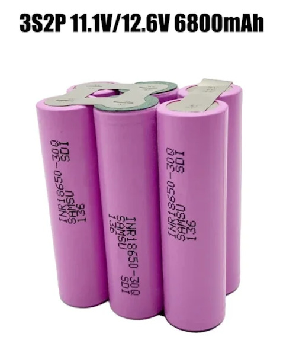

Такой вариант по размерам самый оптимальный, но сварка требует специального оборудования, поэтому
вариант не очень доступный. Можно пробовать паять без сварки, но есть риск повредить батарею.

###### Батарейный отсек

Отсек выглядит так:

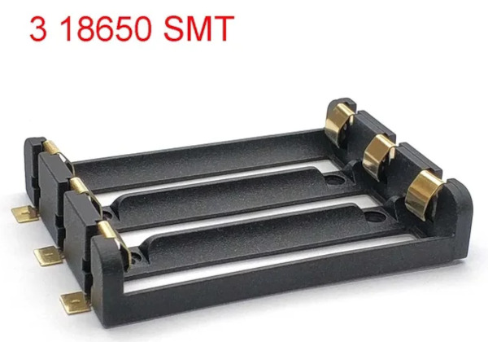

Искать по запросу "3S 18650 Battery Storage Case SMD SMT THM 3 18650 Battery Box 18650 Battery Holder with Bronze Pins"

С батарейным отсеком не требуется пайка к аккумулятору, но итоговые размеры 
будут чуть больше. Размеры отсека 77.1MM*61.4MM*14.9MM, то есть в высоту ничего не добавляется, в ширину и глубину 
добавляется 12 и 7 мм соответственно.

По схеме защиты и заряду варианты таковы:

1. Без защиты от переразряда и перезаряда. 
2. С защитой от переразряда и балансировкой

###### Без защиты
В этом случае лучше использовать только ячейки без плат BMS. Этот вариант подходит при наличии 
зарядного устройства с балансировкой заряда и внешнего индикатора разряда. Если делать с нуля, то лучше 
использовать сразу вариант с защитой.

Для заряда подходит универсальное зарядное устройство IMAX B6/B6AC:

Если сборка сделана на батарейном отсеке, то можно заряжать аккумуляторы по отдельности зарядкой для 18650:

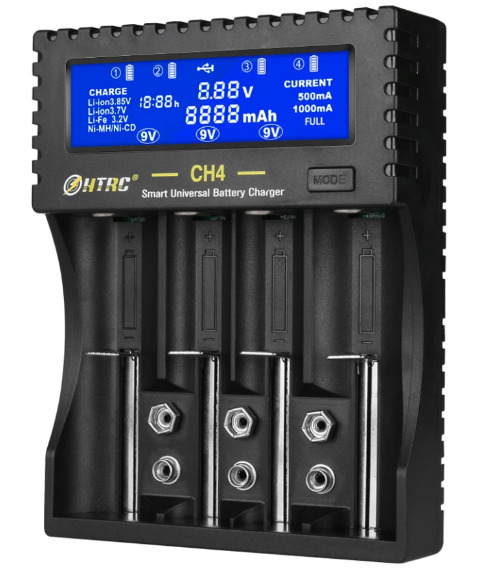

Для контроля разряда нужно использовать индикаторы в виде измерителя напряжения со звуковым сигналом. 
При достижении минимального порога напряжения на элементе аккумулятора устройство пищит и мигает светодиодами.

Электрическая схема:

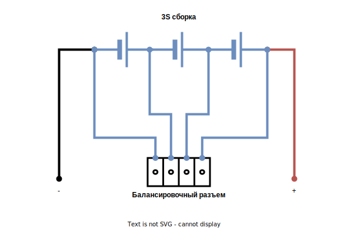

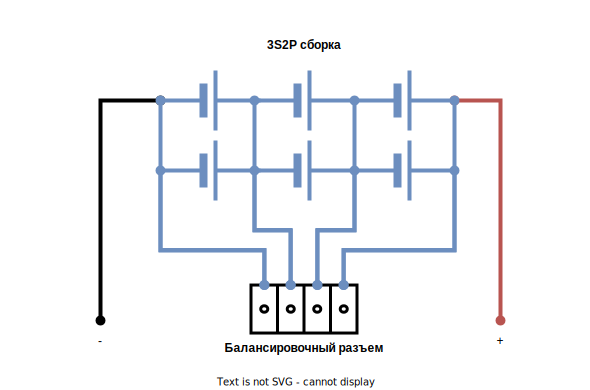

В итоге должно получиться что-то такое в варианте со сваркой:

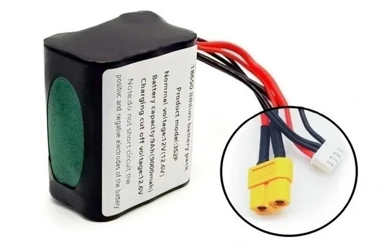

Картинки варианта с батарейным отсеком нет, но суть понятна.

###### С защитой

Вариант с защитой самый надежный и безопасный. В этом варианте для балансировки заряда и защиты от переразряда 
используется плата BMS (Battery Management System). Есть варианты BMS с балансировкой заряда и без. Плата балансировки
обеспечивает только защиту от переразряда и короткого замыкания. Но если уже делать с BMS, 
то нужна модель с балансировкой заряда. 

Схема подключения:

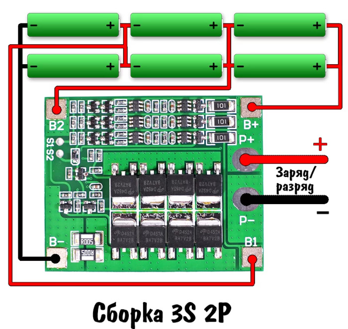

Искать по запросу "1S/2S/3S/4S/5S Li-ion 18650 Lithium Battery Charger Lipo Cell Module PCB BMS Protection Board For Drill Motor with Balance"

Для зарядки и нагрузки можно использовать один разъем XT60, но лучше добавить отдельный разъем для 
зарядки, так как зарядники чаще всего идут с разъемом 2.1 мм. 
Зарядники отличаются силой тока заряда. Для выбора тока заряда используется формула: 
Ток заряда I = 0.5*емкость (для 2200 mAh = 1100 mA)

Для зарядки будет использоваться простое зарядное устройство вида:

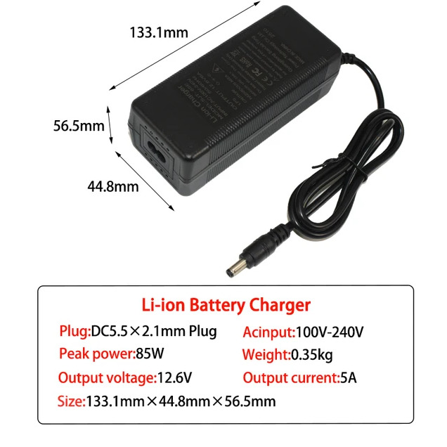

Искать по запросу "Li-ion 12.6V 5A Lithium Battery Charger for 3S 18650 Li-ion Packs"

### Итого по источнику питания

Наиболее оптимальным видится вариант Li-Ion 3S1P с BMS платой. В этом случае можно сделать несъёмный
источник питания и просто подключать зарядку к боту. Максимальное удобство и безопасность.
В текущем проекте будет использоваться Li-Po аккумулятор, так как он уже есть в наличии и есть
зарядник с балансировкой.

## Преобразователи напряжения

### Параметры

Для потребителей, требующих 5 вольт, будем использовать понижающий преобразователь напряжения.
Ранее мы посчитали, что максимальный ток будет 4A. Необходимо иметь запас, поэтому
нужно ориентироваться на 10A

#### Понижающий DC-DC Step Down преобразователь LM2596

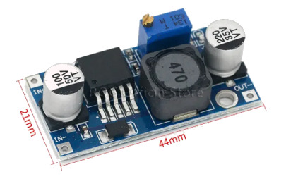

* Входное напряжение: 4.5V - 28 Вольт
* Выходное напряжение: 0.8 - 20 Вольт (регулируемое)
* Максимальный выходной ток: 3A
* Рекомендуемый выходной ток: 2A
* КПД: 96%

Не проходит по току для одноплатного компьютера. В обзорах указано, что при токе 3 А
может работать не более нескольких минут. 

#### Понижающий DC-DC Step Down преобразователь XL4005/XL4015

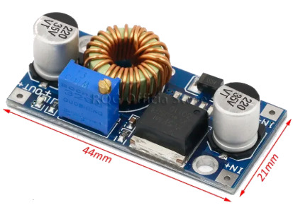

* Входное напряжение: 4 - 38 Вольт
* Выходное напряжение: 1.25 - 32 Вольт (регулируемое)
* Максимальный выходной ток: 5A (рекомендуется установить радиатор)
* Рекомендуемый выходной ток: 4.5A
* КПД: 96%

Один преобразователь будет работать на пределе и без запаса, поэтому можно использовать два преобразователя
для разных групп потребителей. 
Самое большое потребление будет у одноплатного компьютера — 3–4A (без питания периферии). Можно выделить 
один преобразователь только под одноплатник, а остальных потребителей подключить через второй преобразователь.

#### Понижающий DC-DC Step Down преобразователь XL4016E1

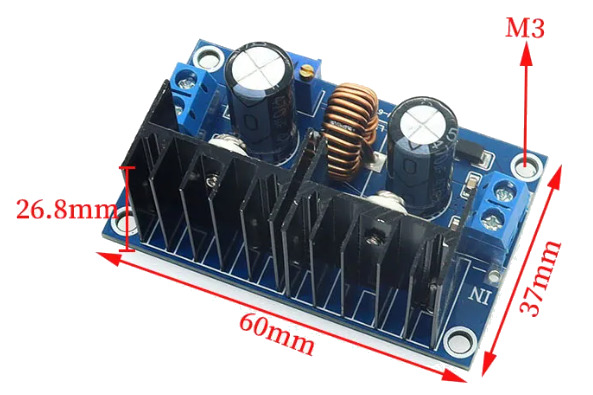

* Входное напряжение: от 4 до 38 V
* Выходное напряжение: от 1.25 до 36 V
* Выходной ток: 8A
* Выходная мощность: до 250 Вт
* КПД: до 95%

Эта модель потянет всех потребителей, но она имеет большой размер, поэтому не так удобна.

#### UBEC-7A

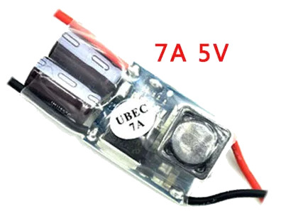

* Входное напряжение 5.5V-35V (2-8S LIPO)\
* Output voltage: 5.25V±0.5V
* Выходной длительный ток: 6A
* Пиковый ток: 7.5A 20 sec

Потенциально можно использовать UBEC, которые используются в RC моделях, но у них 
большой разброс выходного напряжения и одноплатный компьютер может не запуститься.

#### Понижающий DC-DC Buck преобразователь Cedar 10A

High Power DC-DC Buck Module 9-14V to 5V Step down Voltage Power Supply Regulator for Power Supply Module

* Входное напряжение: DC 9-14V
* Выходное напряжение: 5V±0.1V
* Выходной длительный ток: 10A, Max

Идеальный по размеру и по мощности, но нужно тестировать на соответствие заявленным параметрам.
Найден [обзор конвертера](https://www.youtube.com/watch?v=GEXZrJfdjXs), из которого следует, 
что конвертер имеет большой запас по току и подходит нам.

### Итого по преобразователям

Идеально подходит Cedar DC-DC Buck преобразователь 10A. 

## Электрическая схема

С учётом всех компонентов электрическая схема будет такая:

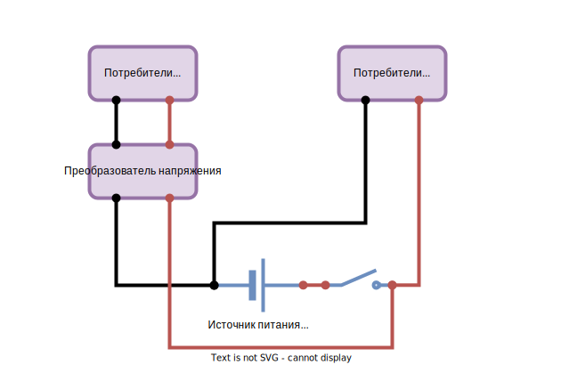

Для выключения питания будем использовать кнопочный выключатель 
KCD1 21*15mm ON-OFF Boat Car Rocker Switch:

Провода силиконовые 18AWG.
Для 12 V — разъёмы XT60.
Для 5 V — разъёмы XT30.

## 3D Модель
 
Необходимо разместить компоненты на платформе. 

* Для аккумулятора реализован держатель, в который его можно вставить и извлекать для зарядки. 
* Преобразователь напряжения крепим к платформе через подставки.
* Выключатель очень хорошо держится между стойками в задней части.
* Сигнализатор разряда подключается к аккумулятору и не требует крепления. 

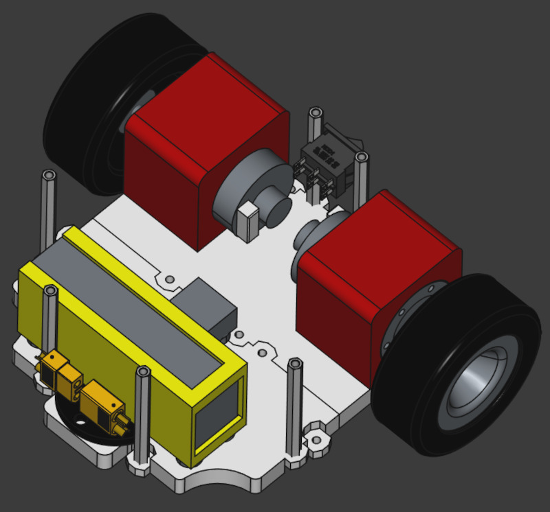

## Реализация

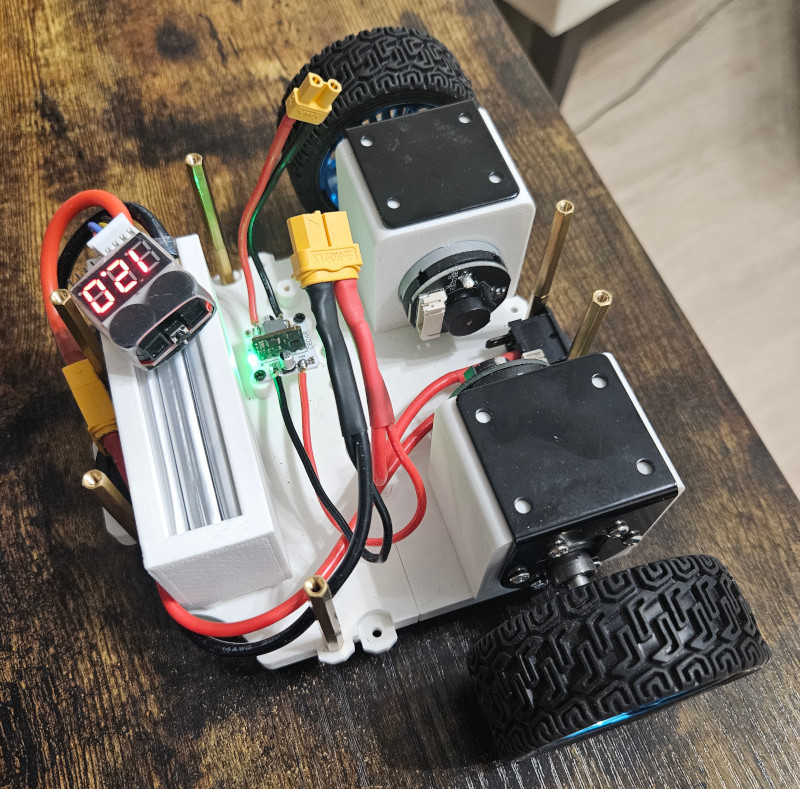
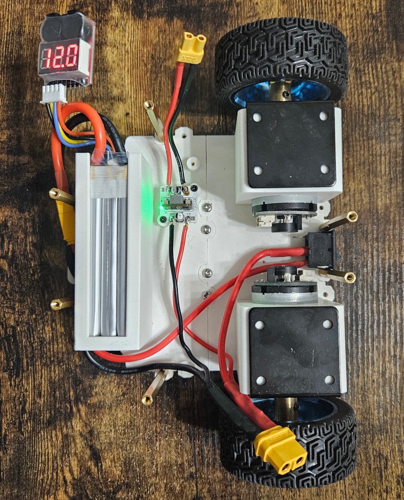

## Список компонентов

| Компонент                  | Модель                                                                                                                          | Картинка                                                                                                                                                          |
|----------------------------|---------------------------------------------------------------------------------------------------------------------------------|-------------------------------------------------------------------------------------------------------------------------------------------------------------------|
| Аккумулятор                | HRB 3S LiPo Battery 11.1V 2200mAh 50C for RC Car with Deans Plug XT60 Connector For RC Car Helicopter Drone Boat Airplane       |                |
| Защита аккумулятора        | 1pcs or 4pcs Hot Sell 2s 3s 4s 5s 6s 7s 8S 1-8S LED Low Voltage Buzzer Alarm Lipo Voltage Indicator Checker Tester Wholesale |                  | 
| Преобразователь напряжения | Cedar High Power DC-DC Buck Module 9-14V to 5V Step down Voltage Power Supply Regulator for Power Supply Module                 |  |
| Провод                     | Провод 18AWG (0.8 мм2) в силиконовой изоляции. Луженая медь. 1 метр - черный. 1 метр - красный.                                 |                                                                                                                                                                   |
| Провод                     | Провод 14AWG (2 мм2) в силиконовой изоляции. Луженая медь. 1 метр - черный. 1 метр - красный.                                   |                                                                                                                                                                   |
| Выключатель клавишный      | KCD1 21*15mm ON-OFF Boat Car Rocker Switch                                                                                      |    |
| Разъемы для 12 V           | XT60 Male/Female                                                                                                                |              |
| Разъемы для 5v             | XT30 Male/Female                                                                                                                |                                                                                                                                                                   |
| Зарядное устройство        | IMAX B6AC 80W RC Balance Charger+                                                                                               |            |

## Ссылки

Для анализа использовались следующие источники:
* http://rc-aviation.ru/rc-ob/1294-accum/2219-samodelnie-liion
* https://alexgyver.ru/18650/
* https://mysku.club/blog/china-stores/40848.html
* https://magzaryada.ru/
* https://supereyes.ru/articles/power_supply/kak-vybrat-dc-dc-preobrazovatel/
* https://youtu.be/hPHiYvfqF7c?si=IJL5UCo2Ozq4r1-J
* https://www.youtube.com/watch?v=GEXZrJfdjXs