примерное расположение, нет деталей по этажам, нет креплений, общее понимание, ограничения этой модели
Мы уже понимаем из каких основных компонентов состоит бот:

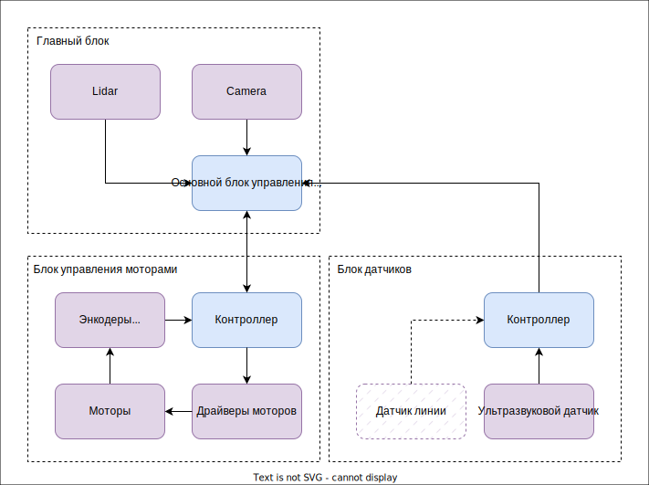

| Компонент                    | Реализация                                                                                                                      | 3D Модель                                   |
|------------------------------|---------------------------------------------------------------------------------------------------------------------------------|---------------------------------------------|
| Основной блок управления SBC | Official Original Raspberry Pi 5 Cortex-A76 Linux 8GB Arm Board                                                                 | 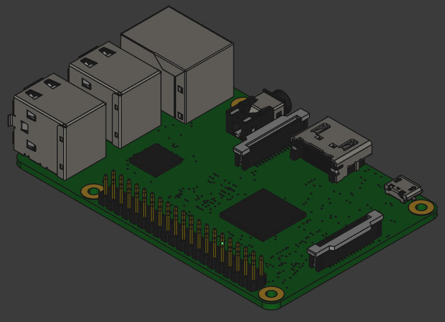                   |
| Контроллер                   | Nano 3.0 Mini Type-C Micro USB With the bootloader compatible Nano controller for arduino CH340 USB driver 16Mhz ATMEGA328P     | 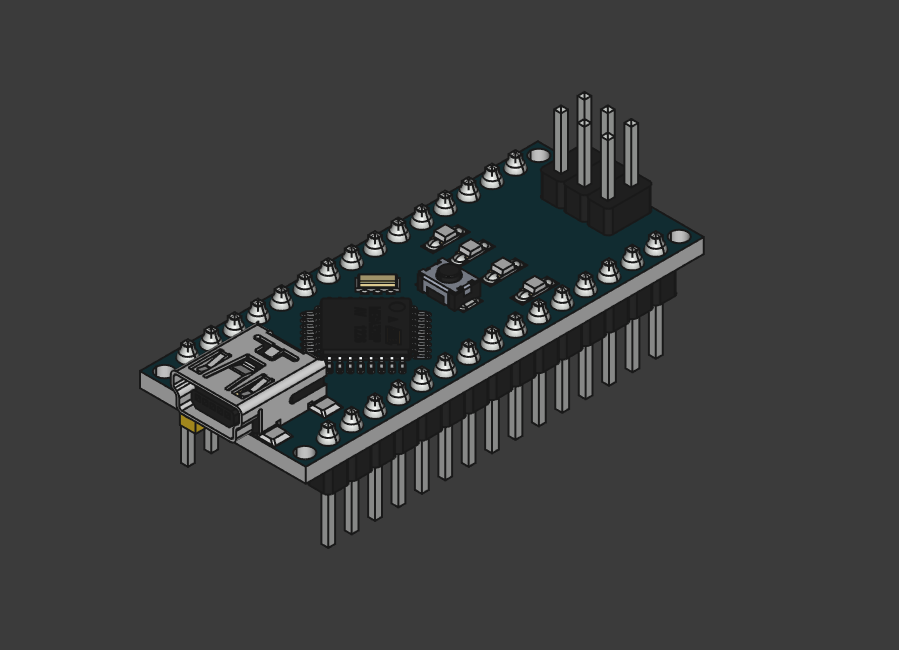           |
| Лидар                        | Original LDS Lidar For Xiaomi Mijia STYTJ02YM Robot Vacuum Cleaner Accessory Replacement MVXVC01-JG Laser Distance Sensor Parts | 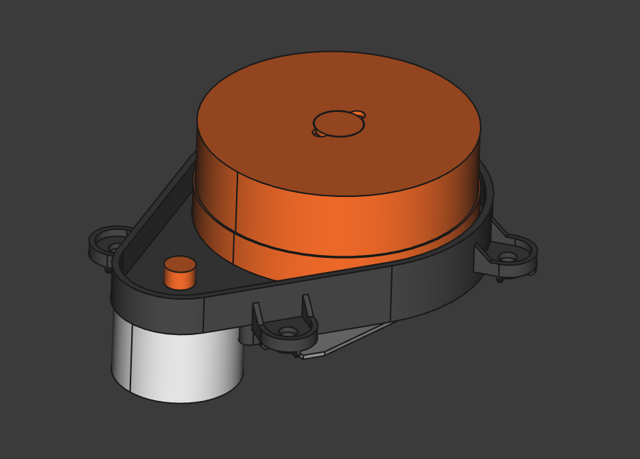               |
| Драйвер моторов              | L298N Stepper DC Motor Driver                                                                                                   | 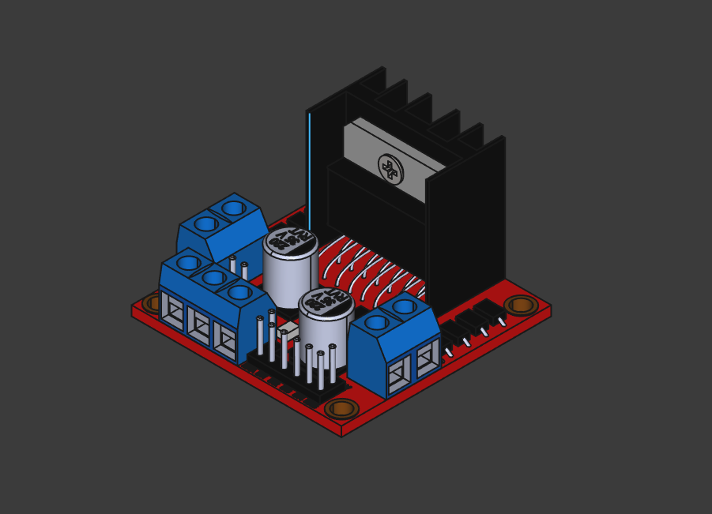 |
| Мотор с энкодером            | JGB37-520 encoder motor Smart car motor DC 12V small motor car kit speed motor                                                  | 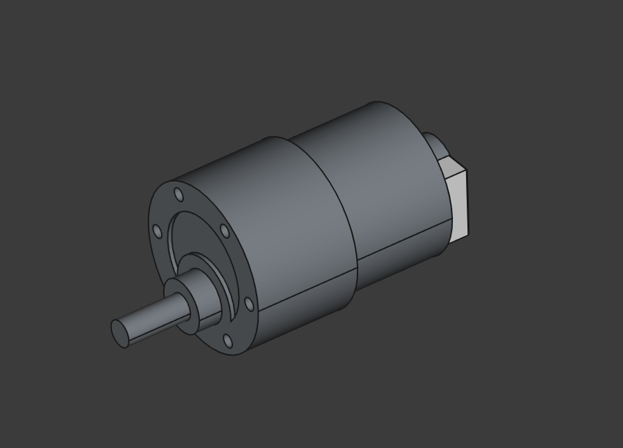               |
| Преобразователь напряжения   | TZT 1/5/10pcs LM2596 DC to DC Buck Converter 3.0-40V to 1.5-35V Power Supply Step Down Module                                   | 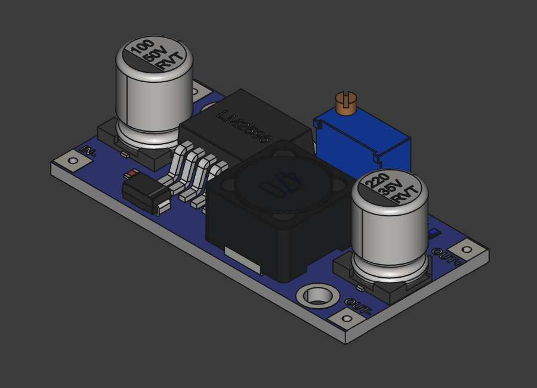                 |
| Аккумулятор                  | HRB 3S LiPo Battery 11.1V 2200mAh 50C for RC Car with Deans Plug XT60 Connector For RC Car Helicopter Drone Boat Airplane       | 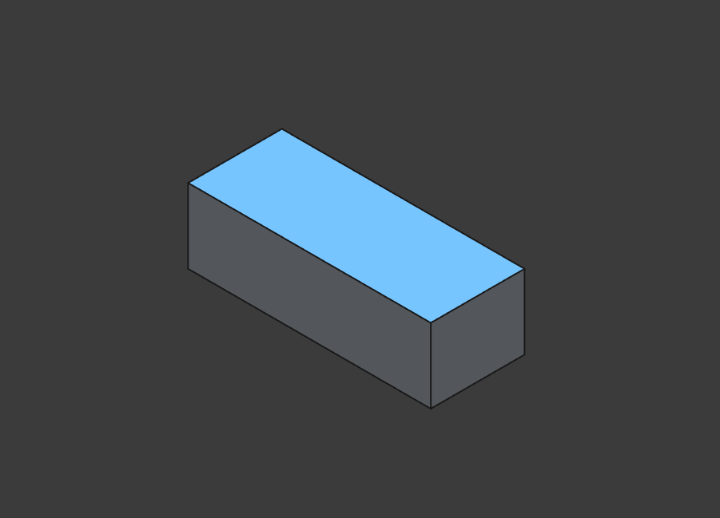           |
| Камера                       | Raspberry Pi Camera Module 3                                                                                                    | 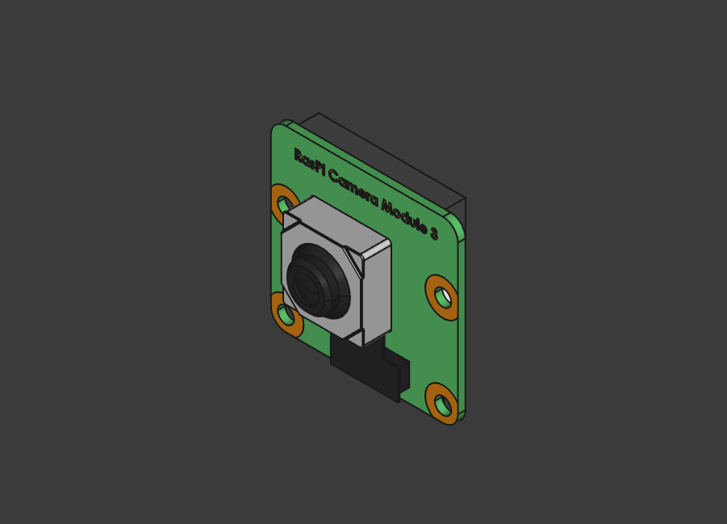             |
| Ультразвуковой датчик        | 3.3V-5V/5V HC-SR04 HYSRF05 Ultrasonic Ranging Module Sensor                                                                     | 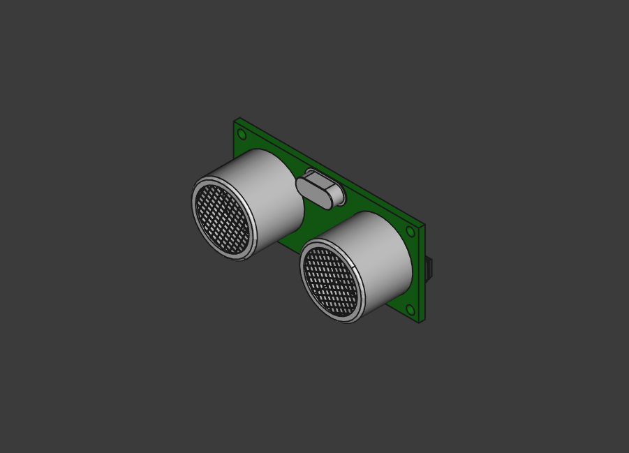     |
| Основание                    | 3D печать                                                                                                                       | 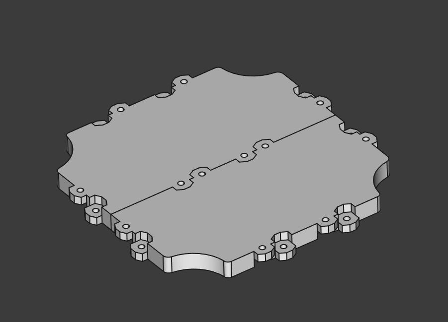               |
| Основание шасси              | 3D печать                                                                                                                       | 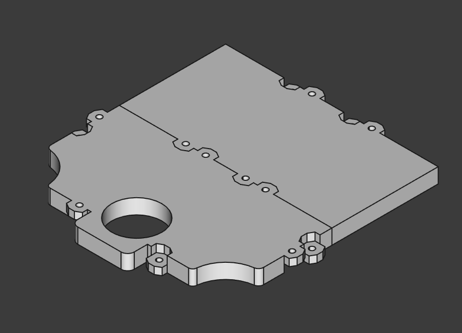     |
| Роликовое колесо             | Self Adhesive Caster Mini Swivel Wheels Stainless Steel Universal Wheel 360 Degree Rotation Pulley for Furniture Trash Can      | 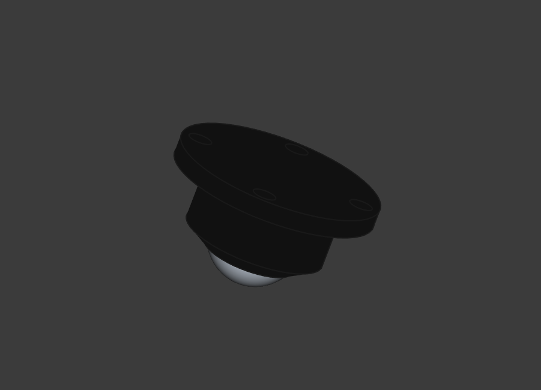 |
| Колесо                       | Car Model 65MM Tyre Big Friction Wheel Toy Intelligent Car Robot Wheel Wheel DIY                                                |                                             |
 

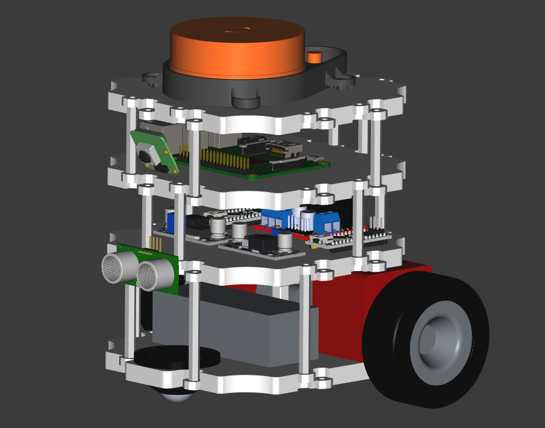

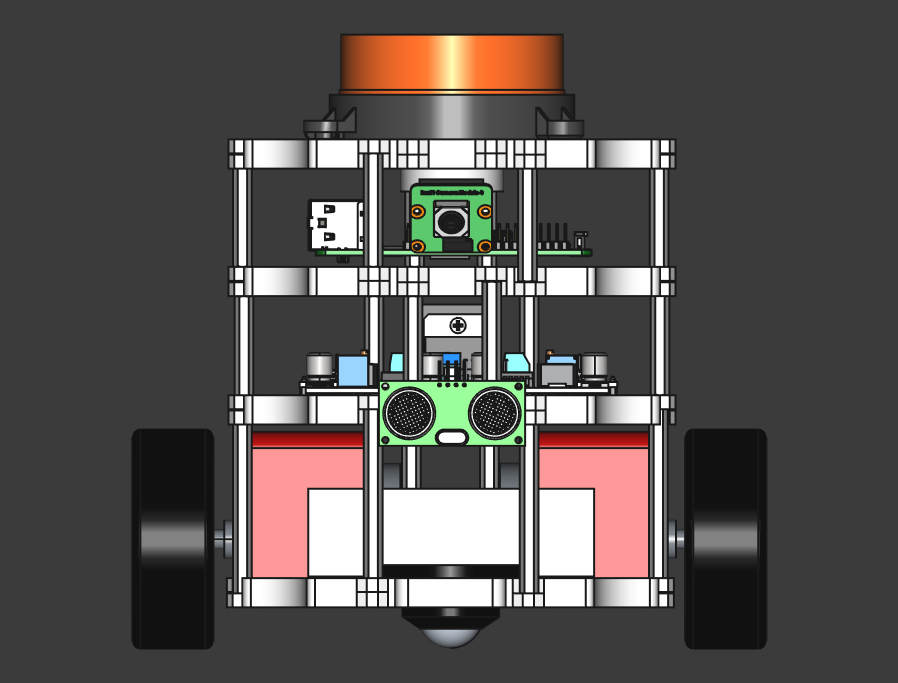

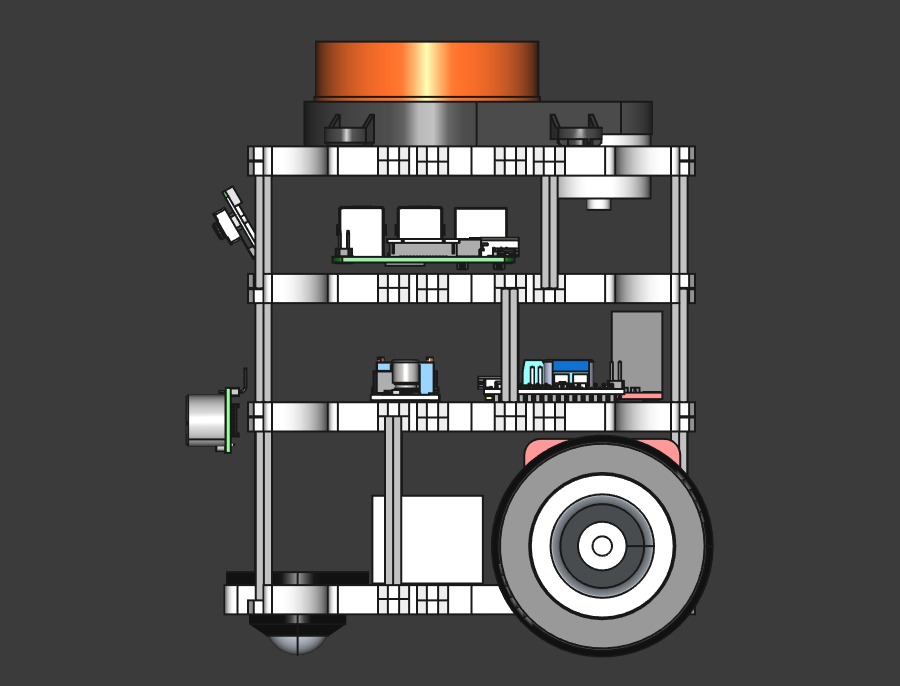