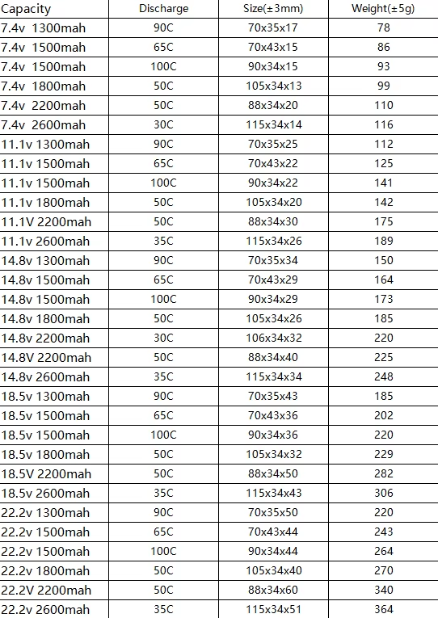

### Расчет питания

Потребители с током

| Потребитель   | Ток   |
|---------------|-------|
| Мотор         | 1A    |
| Мотор         | 1A    |
| Ардуино       | 100ma |
| RPI 4 Model B | 2A    |
| Лидар         | 500ma |
| Всего         | 5A    | 

Получаем потребление в районе 5 ампер

Расчет времени работы

2200mah/5000ma = 0,44 h = 26 min

2200mah*50 = 2,2A*50 = 110AMP

3S 2200mah 50C XT60

