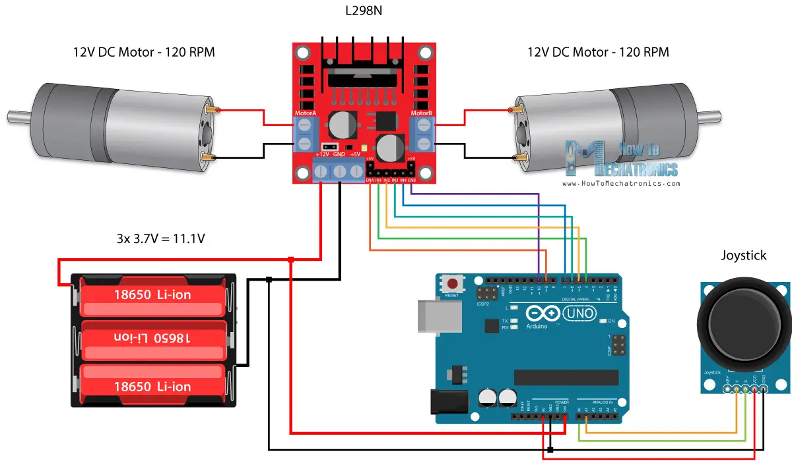

На логической диаграмме расписать все точки интеграции подробно.
Сейчас не до конца понятно разграничение между основным блоком и
блоком управления приводом.

* Уровень мощности 0-100 для каждого колеса
* Скорость вращения колеса.
* Скорость движения и угол поворота - не всегда можем знать
    * Какой смысл при движении?
    * При нулевой скорости сможем точно повернуть
* Скорость движения и угловую скорость - скорость поворота зависит от ошибки
* Скорость движения и угол отклонения

Зачем использовать энкодеры? Можно же и без них.
* Измерять точно скорость вращение мотора
* Зная скорость вращения мы можем делать точные повороты на нужный градус
* Можем точно посчитать/задать угловую скорость
* Можем точно посчитать/задать скорость
* Можно построить точную кинематическую модель двухколесного дифференциального привода

Сценарии использования

