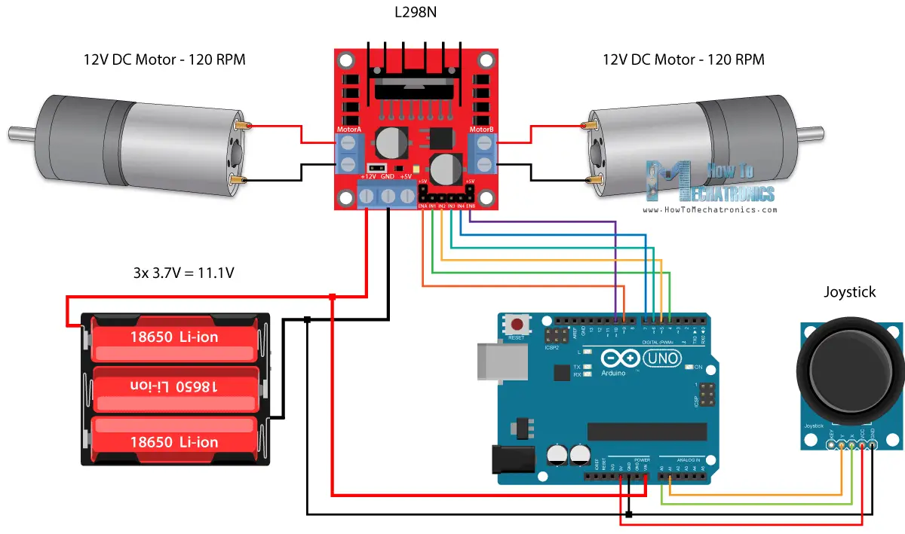

## API

| КОМАНДА         | ОПИСАНИЕ                                                                                                                |
|-----------------|-------------------------------------------------------------------------------------------------------------------------|
| `set_speed v ω` | Ехать: линейная скорость v (мм/с), угловая ω (рад/с, + = против часовой).<br>Внутри — кинематика и PID на каждое колесо |
| `stop`          | Стоп: отключить драйвер, свободный выбег колёс                                                                          |
| `power_stop`    | Экстренное торможение: L298N fast stop, 300 мс, затем выбег                                                             |

## Управление через bluetooth 

Используемый модуль: HC-06

### Подключение электрическое

| Провод       | Направление | Куда идёт           |
|--------------|-------------|---------------------|
| Arduino D13  | →           | Level shifter HV1   |
| Arduino D12  | ←           | Level shifter HV2   |
| Arduino 5V   | →           | Level shifter VCC_HV|
| Arduino 3.3V | →           | Level shifter VCC_LV|
| Arduino GND  | →           | Level shifter GND   |
| Arduino GND  | →           | HC-06 GND           |
| Level LV1    | →           | HC-06 RXD           |
| Level LV2    | ←           | HC-06 TXD           |
| 5V (Cedar)   | →           | HC-06 VCC           |
| GND (Cedar)  | →           | HC-06 GND           |

При подключении к D0 и D1 не работает USB подключение. Надо уводить на другие пины

### Подключение на PC

```shell
bluetoothctl devices

Device 00:21:13:00:0C:E3 HC-06
```
PIN 1234
```shell
bluetoothctl pair 00:21:13:00:0C:E3
Attempting to pair with 00:21:13:00:0C:E3
[CHG] Device 00:21:13:00:0C:E3 Connected: yes
[CHG] Device 00:21:13:00:0C:E3 RSSI is nil
[CHG] Device 00:C3:F4:06:6A:F3 RSSI is nil
[CHG] Controller C4:85:08:AD:5A:56 Discovering: no
[CHG] Device 00:21:13:00:0C:E3 Bonded: yes
[CHG] Device 00:21:13:00:0C:E3 UUIDs: 00001101-0000-1000-8000-00805f9b34fb
[CHG] Device 00:21:13:00:0C:E3 ServicesResolved: yes
[CHG] Device 00:21:13:00:0C:E3 Paired: yes
Pairing successful
```
```shell
sudo rfcomm bind rfcomm0 00:21:13:00:0C:E3 1
```


## Черновик


На логической диаграмме расписать все точки интеграции подробно.
Сейчас не до конца понятно разграничение между основным блоком и
блоком управления приводом.

* Уровень мощности 0-100 для каждого колеса
* Скорость вращения колеса.
* Скорость движения и угол поворота - не всегда можем знать
    * Какой смысл при движении?
    * При нулевой скорости сможем точно повернуть
* Скорость движения и угловую скорость - скорость поворота зависит от ошибки
* Скорость движения и угол отклонения

Зачем использовать энкодеры? Можно же и без них.
* Измерять точно скорость вращение мотора
* Зная скорость вращения мы можем делать точные повороты на нужный градус
* Можем точно посчитать/задать угловую скорость
* Можем точно посчитать/задать скорость
* Можно построить точную кинематическую модель двухколесного дифференциального привода

Что нельзя сделать без энкодера:
* Определить реальную скорость вращения колеса
* Задать абсолютную желаемую скорость движения точки крепления колеса

Какие проблемы не решает энкодер:
* Определение пройденного пути так как могут быть пробуксовки

Как нам помогает знание скорости вращения колеса:
* Это позволить устранить проблему разных моторов. 
* Нужно понять какая максимальная скорость вращения колес 
* Задавать желаемую траекторию движения. Да, будет дрифт, но это будет контролироваться на другом уровне


Сценарии использования:

* Задать количество оборотов в секунду для каждого мотора
* Задать скорость движения точки крепления колеса (зависит от диаметра колеса)

Нужно ли публиковать данные от энкодеров на главный модуль управления? - пока нет




