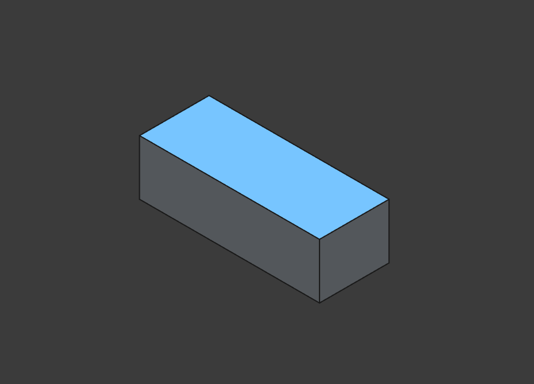
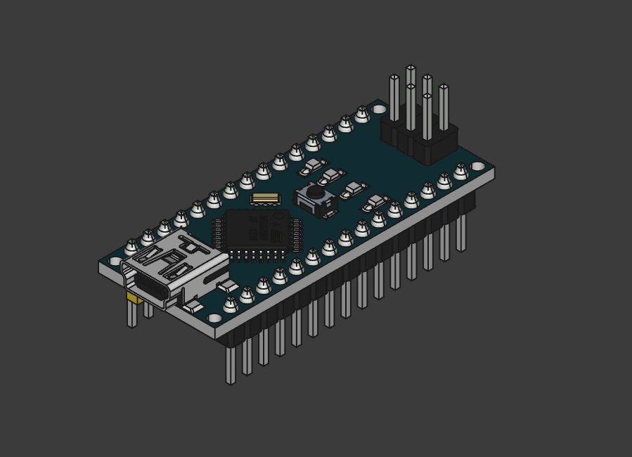
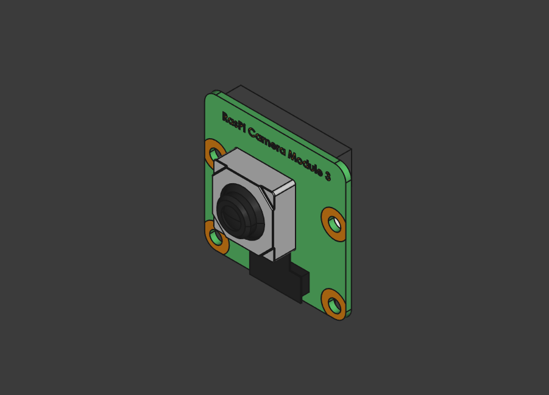
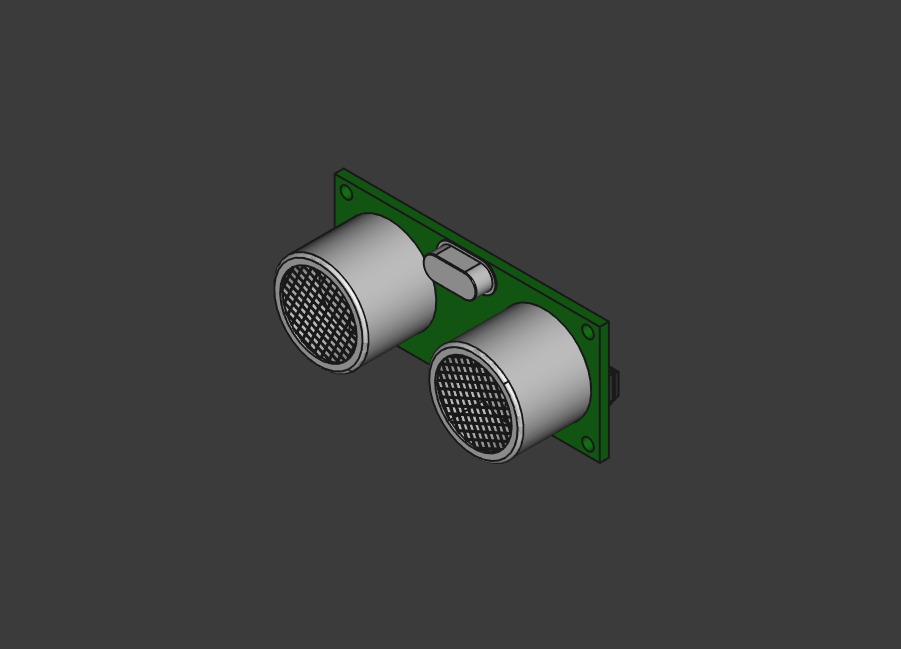
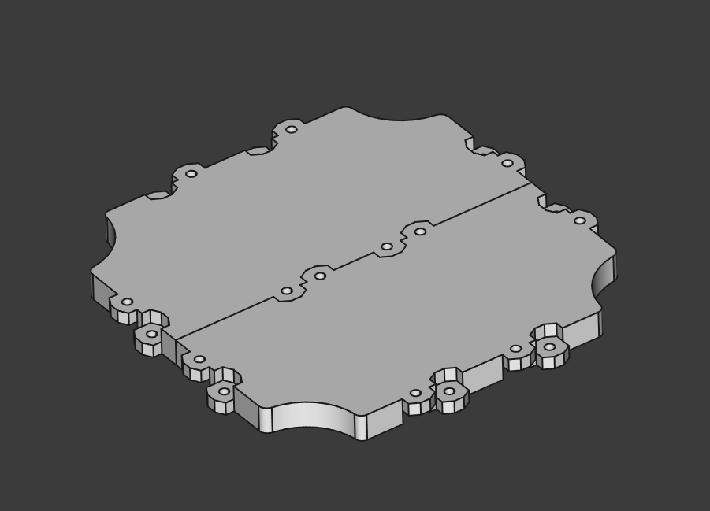
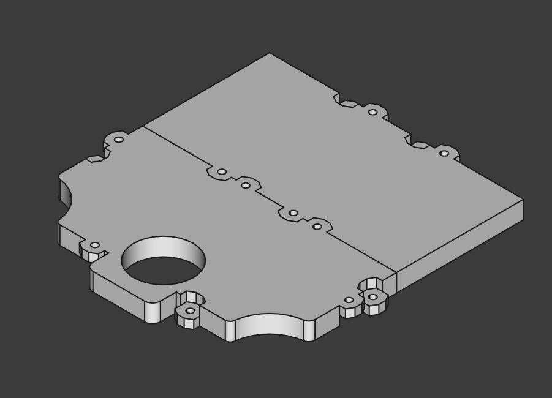
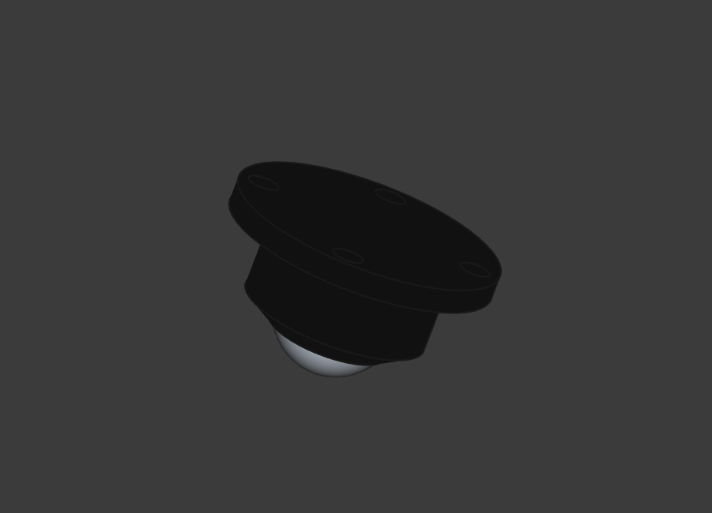
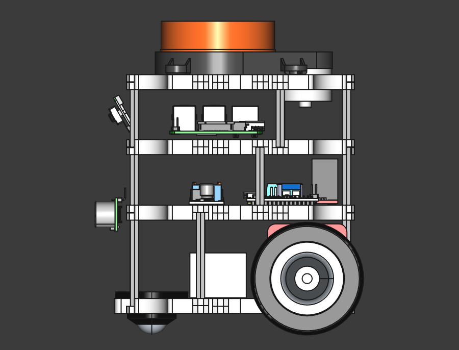

На данном этапе понимаем из каких основных компонентов состоит бот.
М

Компонентная диаграмма:

Схема питания:

Полный список компонентов:

| Компонент                    | Реализация                                                                                                                      | 3D Модель                                     |
|------------------------------|---------------------------------------------------------------------------------------------------------------------------------|-----------------------------------------------|
| Аккумулятор                  | HRB 3S LiPo Battery 11.1V 2200mAh 50C for RC Car with Deans Plug XT60 Connector For RC Car Helicopter Drone Boat Airplane       |              |
| Преобразователь напряжения   | TZT 1/5/10pcs LM2596 DC to DC Buck Converter 3.0-40V to 1.5-35V Power Supply Step Down Module                                   |                    |
| Основной блок управления SBC | Official Original Raspberry Pi 5 Cortex-A76 Linux 8GB Arm Board                                                                 |                      |
| Контроллер                   | Nano 3.0 Mini Type-C Micro USB With the bootloader compatible Nano controller for arduino CH340 USB driver 16Mhz ATMEGA328P     |              |
| Лидар                        | Original LDS Lidar For Xiaomi Mijia STYTJ02YM Robot Vacuum Cleaner Accessory Replacement MVXVC01-JG Laser Distance Sensor Parts |                  |
| Драйвер моторов              | L298N Stepper DC Motor Driver                                                                                                   |    |
| Мотор с энкодером            | JGB37-520 encoder motor Smart car motor DC 12V small motor car kit speed motor                                                  |                  |
| Камера                       | Raspberry Pi Camera Module 3                                                                                                    |                |
| Ультразвуковой датчик        | 3.3V-5V/5V HC-SR04 HYSRF05 Ultrasonic Ranging Module Sensor                                                                     |        |
| Основание                    | 3D печать ([3D модели](https://github.com/makarov-na/turtle-bot-3d-models))                                                     |                  |
| Основание шасси              | 3D печать ([3D модели](https://github.com/makarov-na/turtle-bot-3d-models))                                                     |        |
| Роликовое колесо             | Self Adhesive Caster Mini Swivel Wheels Stainless Steel Universal Wheel 360 Degree Rotation Pulley for Furniture Trash Can      |    |
| Колесо                       | Car Model 65MM Tyre Big Friction Wheel Toy Intelligent Car Robot Wheel Wheel DIY                                                |                  |
| Крепление мотора             | 3D печать ([3D модели](https://github.com/makarov-na/turtle-bot-3d-models))                                                     |  |
| Стойка 35mm,55m(35+20)       | Solid Brass Copper M3 Hex Standoff Hexagon Pillar F-F Female-Female Spacer for PCB Board Motherboard                            |              |
Полный список компонентов со ссылками на магазины тут: [Список компонентов](../%D0%A1%D0%BF%D0%B8%D1%81%D0%BE%D0%BA%20%D0%BA%D0%BE%D0%BC%D0%BF%D0%BE%D0%BD%D0%B5%D0%BD%D1%82%D0%BE%D0%B2/%D0%A1%D0%BF%D0%B8%D1%81%D0%BE%D0%BA%20%D0%BA%D0%BE%D0%BC%D0%BF%D0%BE%D0%BD%D0%B5%D0%BD%D1%82%D0%BE%D0%B2.md)

Это позволяет создать черновую модель бота. В черновой модели не проработаны все детали:

* Отсутствуют крепления камеры, датчиков, аккумулятор и других компонентов
* Расположение компонентов приблизительное

При этом понятно, что все необходимые компоненты подходят по размерам и для них достаточно места.

Общий вид бота:

Вид спереди:

Вид сбоку:

