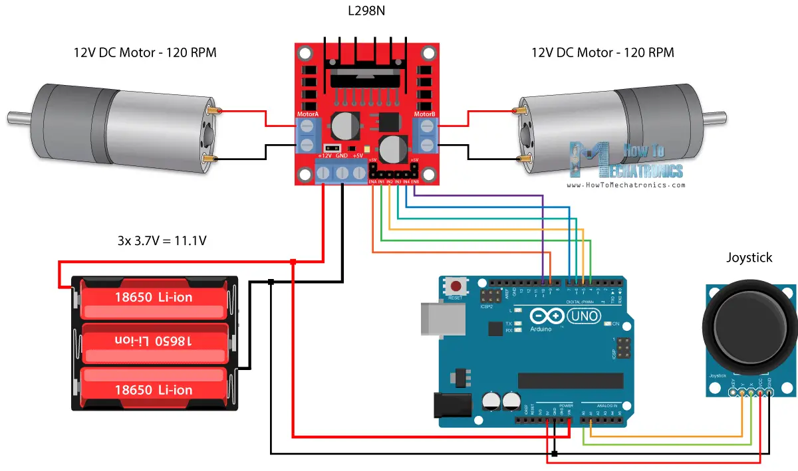

### Общая информация 

* https://github.com/robotis-git/turtlebot3
* https://emanual.robotis.com/docs/en/platform/turtlebot3/overview/

### Схожие проекты

* https://amperka.ru/blogs/projects/abot-robot-part-1****
* https://www.instructables.com/Build-Your-Own-Turtblebot-Robot/
* https://www.printables.com/model/707206-raspberry-pi-3b-cam-rover-with-arm

### 3D Модели

* Модели деталей и описание компонентов доступно тут: https://emanual.robotis.com/docs/en/platform/turtlebot3/features/#specifications
* После регистрации доступна выгрузка в stl https://cad.onshape.com/documents
* Порезать модель на части получилось в https://www.tinkercad.com/

* https://github.com/thedch/indoor-autonomous-system-cad
* https://grabcad.com/library/jgb37-520-12-v-metal-geared-motor-bracket-1

### Схемотехника для моторов

#### Полное описание 
* https://howtomechatronics.com/tutorials/arduino/arduino-dc-motor-control-tutorial-l298n-pwm-h-bridge/

#### Выжимка

Аккумулятор

I'd probably use a rechargeable 4S 14.8V Lipo battery for the motor. An L298N drops quite a lot of the supplied voltage so you need around 15V to have a reasonable chance of getting 12V at the motor.
The battery capacity (mAh) needed will depend on how long you expect the motors to run for. And you'll need a proper Lipo charger too.
There are many other options even a 12V lead-acid battery may work.

