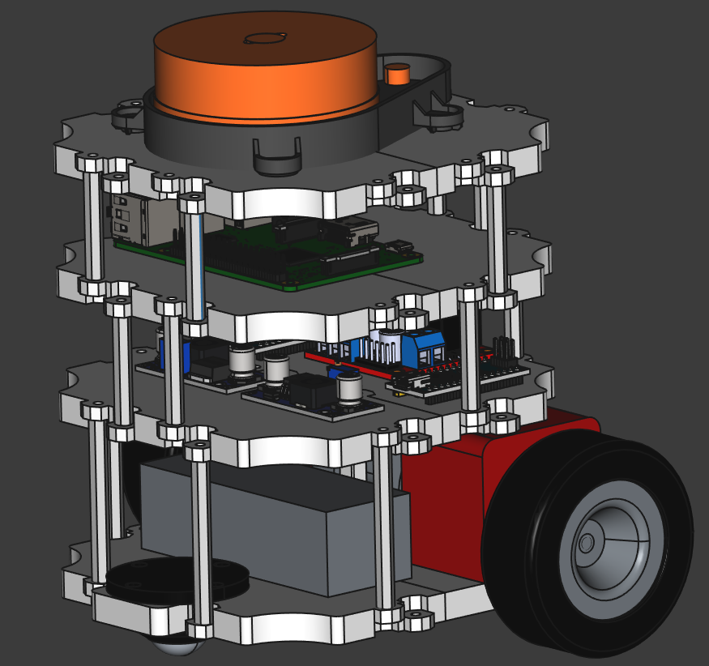

## Реализация по мотивам проекта [TurtleBot3 Burger](https://www.turtlebot.com/) 

Цель проекта: реализация бота с использованием более доступного железа

В проекте используются широко доступные и более дешевые компоненты. 
Реализованы модели для 3D печати в домашних условиях с возможностью адаптации 
под различные компоненты. Для всех деталей доступны исходники в 
формате FreeCAD.

